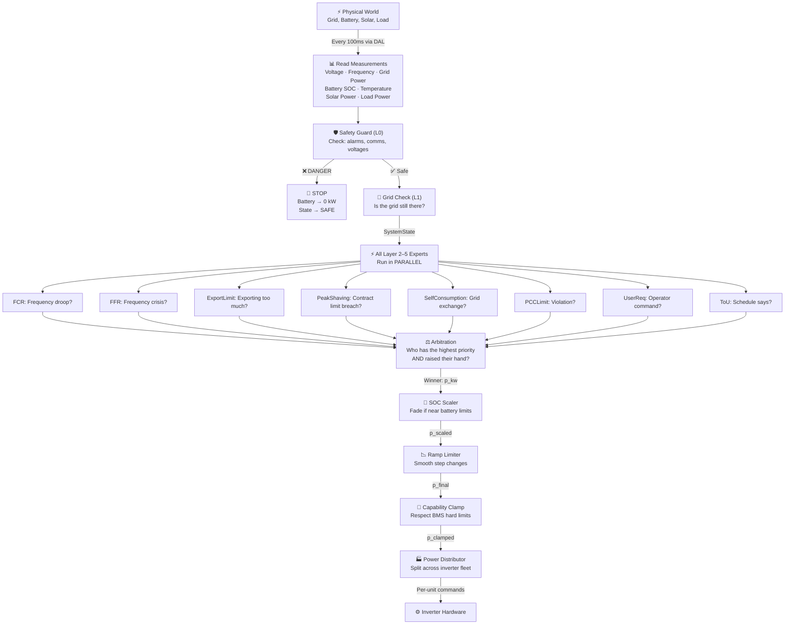
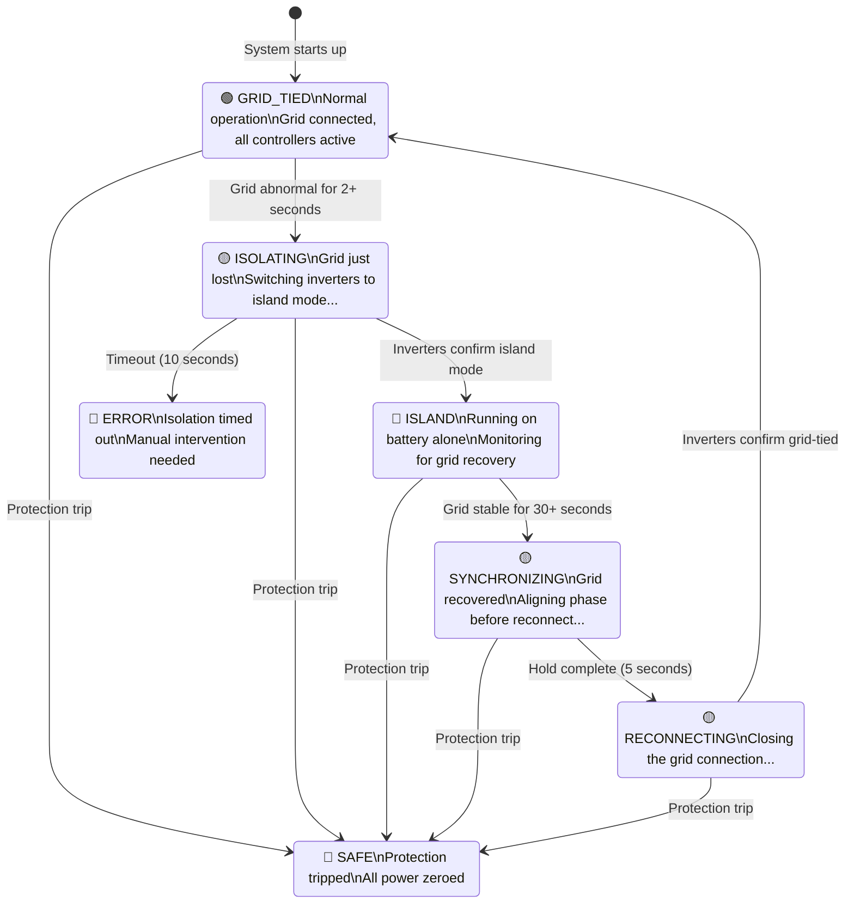

# EMS Edge Controller — System Architecture Guide

> **Who this document is for:** Engineers and technical stakeholders who want to understand
> *what* the controller does, *why* it does it, and *how* it makes decisions — without
> needing to read source code.
>
> **Scope:** `src/ems_edge/controllers/`

---

## Table of Contents

1. [The Big Picture — What Does This System Do?](#1-the-big-picture)
2. [How the System is Organised](#2-how-the-system-is-organised)
3. [The Chain of Command — How Decisions Are Made](#3-the-chain-of-command)
4. [Layer-by-Layer Explanation](#4-layer-by-layer-explanation)
   - [The Safety Guard (Layer 0 — Protection)](#layer-0--the-safety-guard)
   - [The Grid Awareness Engine (Layer 1 — Island)](#layer-1--the-grid-awareness-engine)
   - [The Grid Services Team (Layer 2)](#layer-2--the-grid-services-team)
   - [The Economist (Layer 3 — Time-of-Use)](#layer-3--the-economist)
   - [The Demand Manager (Layer 4 — Peak Shaving)](#layer-4--the-demand-manager)
   - [The Balance Keeper (Layer 5a — Self-Consumption)](#layer-5a--the-balance-keeper)
   - [The Traffic Cop (Layer 5b — PCC Limit)](#layer-5b--the-traffic-cop)
   - [The Operator's Desk (Layer 5c — User Request)](#layer-5c--the-operators-desk)
   - [The Decision Maker (Arbitration)](#the-decision-maker--arbitration)
   - [The Battery Guardian (Pipeline — SOC Scaler)](#the-battery-guardian--soc-scaler)
   - [The Shock Absorber (Pipeline — Ramp Limiter)](#the-shock-absorber--ramp-limiter)
   - [The Fleet Manager (Pipeline — Power Distributor)](#the-fleet-manager--power-distributor)
5. [Complete Data Flow — A Story of One Control Cycle](#5-complete-data-flow)
6. [Configuration Reference — Plain Language](#6-configuration-reference)
7. [What the System Knows — Inputs & Measurements](#7-inputs--measurements)
8. [How the System Communicates — Alarms & Errors](#8-alarms--errors)
9. [The Big State Machine — Operating Modes](#9-operating-modes)
10. [Key Design Principles](#10-key-design-principles)

---

## 1. The Big Picture

Imagine you are managing a building with a large battery pack, solar panels, and a connection to the electricity grid. Every 100 milliseconds, your team must answer one question:

> **"How much power should the battery charge or discharge right now?"**

This sounds simple, but the answer depends on many competing concerns simultaneously:

- Is the grid about to collapse? *(emergency response)*
- Has the grid connection been lost? *(island mode)*
- Is the building about to exceed its contracted power limit? *(demand management)*
- Is there surplus solar energy going to waste? *(self-consumption)*
- What is the cheapest time to charge or discharge? *(economics)*
- Is the operator requesting something specific? *(manual override)*
- Is the battery itself safe to use? *(hardware limits)*

The EMS Edge Controller manages all of these at once, in a structured, predictable way. Each concern gets its own dedicated "expert" — and when they disagree, a clear **chain of command** resolves the conflict.

---

## 2. How the System is Organised

### A Layered Architecture

The controller is built as a **stack of layers**, like floors in a building. Upper floors have higher authority. Each floor independently computes what *it* wants the battery to do, and then a central decision-maker chooses the winner.

```
┌─────────────────────────────────────────────────────────────┐
│      MEASUREMENTS FROM THE REAL WORLD (every 100ms)         │
│   Grid Power · Voltage · Frequency · Battery SOC · Temp     │
└─────────────────────────────────────────────────────────────┘
                            ↓
┌─────────────────────────────────────────────────────────────┐
│  LAYER 0  ── SAFETY GUARD ── Checks for dangerous conditions │ ← Can stop everything instantly
│              If unsafe: all power → 0, system → SAFE        │
└─────────────────────────────────────────────────────────────┘
                            ↓ (only if safe)
┌─────────────────────────────────────────────────────────────┐
│  LAYER 1  ── GRID AWARENESS ── Is the grid still there?     │
│              Manages transitions between grid-tied & island  │
└─────────────────────────────────────────────────────────────┘
                            ↓
┌─────────────────────────────────────────────────────────────┐
│  LAYERS 2–5 ── ALL RUN IN PARALLEL (each makes a proposal)  │
│                                                             │
│  2. Emergency Frequency Response  (grid stability)          │
│  2. Export Limit Enforcement      (contractual)             │
│  2. Transformer Protection        (equipment)               │
│  2. Voltage Curtailment P(V)      (voltage control)         │
│  2. Reactive Power Q(V)           (voltage support)         │
│  3. Time-of-Use Schedule          (economics)               │
│  4. Peak Shaving                  (demand management)       │
│  5. Self-Consumption PID          (energy efficiency)       │
│  5. PCC Limit Guard               (contract enforcement)    │
│  5. User Request Handler          (operator command)        │
└─────────────────────────────────────────────────────────────┘
                            ↓ (10 proposals submitted)
┌─────────────────────────────────────────────────────────────┐
│  ARBITRATION  ── Who wins? The highest-priority active one   │
└─────────────────────────────────────────────────────────────┘
                            ↓ (one winning power value)
┌─────────────────────────────────────────────────────────────┐
│  PIPELINE ── Final Safety Checks Before Hardware            │
│   SOC Scaler → Ramp Limiter → Capability Clamp              │
└─────────────────────────────────────────────────────────────┘
                            ↓
┌─────────────────────────────────────────────────────────────┐
│  POWER DISTRIBUTOR ── Split power among multiple inverters   │
└─────────────────────────────────────────────────────────────┘
                            ↓
┌─────────────────────────────────────────────────────────────┐
│         BATTERY INVERTER(S) — Physical Hardware              │
└─────────────────────────────────────────────────────────────┘
```

### What Does Each Part Know About?

The system reads the physical world through **measurements** and produces **commands** as output. Between input and output sits a clear **data separation**:

- **Measurements** — What is happening right now (grid power, battery temperature, frequency, voltage)
- **Configuration** — Limits and targets set at installation time (never changed while running)
- **Setpoints** — What each expert layer *wants* the battery to do this cycle
- **Commands** — The actual instruction sent to the hardware

---

## 3. The Chain of Command

When multiple layers all want the battery to do different things, the system resolves the conflict with a **fixed priority ranking**. Think of it as a military chain of command — higher ranks override lower ranks, no negotiation.

```
Priority  Source              Why It Wins
────────  ──────────────────  ──────────────────────────────────────────
   1st    FFR (Fast Freq.)    Grid emergency — lives may depend on it
   2nd    Export Limit        Legal/contractual obligation to the grid
   3rd    Peak Shaving        Financial contract with the utility
   4th    Transformer Limit   Protect expensive hardware from damage
   5th    FCR (Freq. Droop)   Grid regulation service obligation
   6th    P(V) Curtailment    Prevent dangerous grid voltage rise
   7th    User Request        Operator has direct control
   8th    ToU Schedule        Economical but not urgent
   9th    Self-Consumption    Efficiency goal, easily overridden
  10th    PCC Limit Guard     Last-resort safety net
```

**Important:** Each layer only "speaks up" when it has something to say. If the grid frequency is perfectly normal, the FCR controller stays silent. The arbitrator only picks from the layers that are actively requesting something this cycle.

---

## 4. Layer-by-Layer Explanation

---

### Layer 0 — The Safety Guard

**Name:** Protection Checker  
**Analogy:** A circuit breaker — if anything is dangerously wrong, it trips *immediately* before anything else runs.

#### What It Watches

The Safety Guard monitors six conditions every cycle. If **any single one** is true, it immediately commands **zero power** and puts the system in a `SAFE` state:

| Condition | What It Means |
|-----------|---------------|
| Emergency Stop pressed | An operator has manually triggered a shutdown |
| BMS alarm active | The battery's own management system is reporting a critical fault (overheating, overcurrent, or insulation failure) |
| Inverter hardware fault | One or more inverters have reported a hardware failure |
| Meter data is stale | The grid meter hasn't reported new data within the timeout — we're flying blind |
| Inverter communication lost | We can't talk to one or more inverters |
| DC voltage too high | The electrical bus voltage inside the battery system is dangerously high |

#### What Happens When It Trips

1. Battery output is immediately set to **zero**
2. System mode is set to **SAFE**
3. All other layers are bypassed — the cycle ends here
4. A ramp-limiter reset happens so that when the system recovers, it ramps up gently

#### Key Settings

| Setting | Default | Plain Explanation |
|---------|---------|-------------------|
| Communication timeout | 2 seconds | If we don't hear from the meter for 2 seconds, we trip |
| Max battery temperature | 55°C | Above this, the battery is considered too hot |
| Max DC current | 300 A | Above this, the DC bus is overloaded |
| Max DC voltage | 850 V | Above this, the DC link is dangerously high |

---

### Layer 1 — The Grid Awareness Engine

**Name:** Island State Machine  
**Analogy:** The captain of a ship deciding whether to sail into port or operate independently at sea.

#### The Core Question

*Is the grid connection healthy right now?*

The system is always in one of six operating modes:

```
Normal operation (grid connected)
        ↓  Grid goes bad
   ISOLATING — switching over to battery-only mode...
        ↓  Inverters confirm they're ready
   ISLAND — running on battery alone
        ↓  Grid comes back and stabilises
   SYNCHRONIZING — preparing to reconnect...
        ↓  Phase angle and frequency aligned
   RECONNECTING — closing the grid connection...
        ↓  Inverters confirm grid-tied
Back to normal operation
```

If the isolation process takes too long (inverters don't respond): **ERROR** state → manual intervention needed.

#### How "Grid Loss" Is Detected

The system looks for **any of three abnormal signs** in the grid measurements:

1. **Voltage out of range** — The grid voltage drops below 50% of normal or rises above 120% of normal. A healthy grid should be close to 230V; anything far from that is suspicious.

2. **Frequency out of range** — Normal is 50 Hz. If frequency drops below 47 Hz or rises above 52 Hz, something is wrong on the grid.

3. **Frequency changing too fast** — Even if frequency is currently ok, if it's changing faster than the threshold (Rate of Change of Frequency, or ROCOF), a collapse may be coming.

All three are measured continuously, but the system only commits to island mode if the condition persists for a **validation time** (default 2 seconds). This prevents false triggers from brief glitches.

#### How "Grid Restoration" Is Detected

When the grid comes back, the system applies stricter checks than for detection — it wants to be *sure* the grid is stable before reconnecting:

- Voltage must be between 90% and 110% of normal (tighter than the loss window)
- Frequency must be between 49.5 Hz and 50.5 Hz
- These must be stable for **30 seconds** before reconnect is attempted

#### Key Settings

| Setting | Default | Plain Explanation |
|---------|---------|-------------------|
| Auto island on grid loss | Yes | Automatically switch to island when grid fails |
| Grid loss voltage range | 50%–120% of nominal | Outside this = grid considered lost |
| Grid loss frequency range | 47–52 Hz | Outside this = grid considered lost |
| ROCOF threshold | 5 Hz/s | If frequency changes this fast, grid may be collapsing |
| Validation time (loss) | 2 seconds | Must be abnormal for this long before switching |
| Restore voltage range | 90%–110% of nominal | Grid must be in this range to reconnect |
| Restore frequency range | 49.5–50.5 Hz | Grid must be in this range to reconnect |
| Validation time (restore) | 30 seconds | Must be stable for this long before reconnecting |
| Isolation timeout | 10 seconds | If inverters don't confirm island in 10s → ERROR |

---

### Layer 2 — The Grid Services Team

Five specialists run simultaneously, each focused on one specific grid condition:

---

#### Frequency Droop Response (FCR)

**Analogy:** A hand on the throttle — when the engine slows, you add more fuel proportionally.

**What it does:** When the grid frequency drops (meaning generators are struggling), the battery automatically discharges to help stabilise it. The response is proportional — a small frequency deviation causes a small battery response; a large deviation causes a larger response.

**The logic:**
- If frequency is within ±0.05 Hz of 50 Hz → do nothing (deadband)
- If frequency drops below 49.95 Hz → discharge battery proportionally
- If frequency rises above 50.05 Hz → charge battery proportionally
- The strength of response is set by the "droop percentage" — a 5% droop means the battery reaches full power at a 2.5 Hz deviation

| Setting | Default | Plain Explanation |
|---------|---------|-------------------|
| Deadband | ±0.05 Hz | Small variations are ignored to prevent unnecessary cycling |
| Droop | 5% | How steeply the response ramps up with frequency deviation |
| Max power | 100 kW | The most the FCR controller will ever request |

---

#### Fast Frequency Response (FFR)

**Analogy:** A fire extinguisher — when there's a crisis, you blast it immediately with maximum power.

**What it does:** For severe frequency drops (below 49.2 Hz), this kicks in *immediately* with a fixed, maximum power injection. Unlike FCR which is proportional, FFR is binary — either full emergency power or nothing. It holds that power for up to 30 seconds, then releases.

**The logic:**
- Frequency falls below 49.2 Hz → immediately inject 100 kW (discharge)
- Keep injecting until:
  - Frequency recovers above 49.5 Hz (early release), OR
  - 30 seconds has passed (timer expiry)
- Then return to inactive

**Why FFR has the highest priority:** A frequency crisis can cascade into a grid blackout within seconds. Speed and certainty matter more than economy.

| Setting | Default | Plain Explanation |
|---------|---------|-------------------|
| Trigger frequency | 49.2 Hz | Below this → FFR fires immediately |
| Emergency power | 100 kW | Fixed power output during FFR |
| Hold duration | 30 seconds | Maximum time FFR stays active |
| Release frequency | 49.5 Hz | If frequency recovers to this → FFR releases early |

---

#### Export Limit

**Analogy:** A one-way valve — it allows power to flow to the grid up to a limit, and forces the battery to absorb any excess.

**What it does:** Some grid connections (especially with solar) have a contractual limit on how much power can be *exported* to the grid. When solar generation exceeds site load and would otherwise flood the grid, the battery charges to absorb the surplus.

**The logic:**
- Calculate how much power is currently flowing out to the grid
- If that exceeds the limit → command the battery to charge (absorb the excess)
- The charge setpoint equals: `Limit − PV generation` (battery absorbs what the grid can't take)

| Setting | Default | Plain Explanation |
|---------|---------|-------------------|
| Export limit | 50 kW | Maximum allowed export to grid at any time |

---

#### Transformer Thermal Protection

**Analogy:** A speed limiter that slows down as the engine overheats.

**What it does:** The transformer connecting the battery to the grid has a current rating. If the battery discharges too aggressively, the transformer current can exceed its rating, causing accelerated wear or damage. This controller proportionally reduces discharge power when transformer current is high.

**The logic:**
- If transformer current is below its rated value → do nothing
- If it exceeds the rating → reduce discharge power proportional to the overload
- The more overloaded, the more the discharge is cut back

| Setting | Default | Plain Explanation |
|---------|---------|-------------------|
| Transformer rated current | 250 A | Normal maximum operating current |
| Gain | 10 kW/A | How much to cut per amp of overload |
| Max cut | 100 kW | Maximum discharge reduction applied |

---

#### Reactive Power / Voltage Support — Q(V)

**Analogy:** A voltage stabiliser — injects or absorbs reactive power to keep voltage steady.

**What it does:** Grid voltage can sag when there's heavy load, or rise when there's excess generation. This controller injects *reactive power* (not active power) to stabilise voltage. Reactive power doesn't charge or discharge the battery — it adjusts the apparent voltage seen by the grid.

**The logic (S-shaped curve):**
- Voltage is very low → inject maximum reactive power (support voltage)
- Voltage is slightly low → inject reactive power proportionally
- Voltage is normal (within deadband) → do nothing
- Voltage is slightly high → absorb reactive power proportionally
- Voltage is very high → absorb maximum reactive power (suppress voltage)

| Setting | Default | Plain Explanation |
|---------|---------|-------------------|
| Deadband (low) | 0.98 pu (225.4V) | Below this, start injecting reactive power |
| Deadband (high) | 1.02 pu (234.6V) | Above this, start absorbing reactive power |
| Max reactive power | 50 kVAr | Maximum reactive power available |

---

#### Active Power Voltage Curtailment — P(V)

**Analogy:** A pressure relief valve — when voltage gets too high, it forces the battery to absorb excess energy.

**What it does:** When solar generation is high and load is low, grid voltage can rise dangerously. This controller forces the battery to *charge* (absorb energy) when voltage is high, directly pulling voltage back down.

**The logic:**
- Voltage is below 1.05 pu (241.5V) → do nothing
- Voltage exceeds 1.05 pu → charge the battery proportionally
- The higher the voltage above the threshold, the harder the battery charges

| Setting | Default | Plain Explanation |
|---------|---------|-------------------|
| Voltage threshold | 1.05 pu (241.5V) | Above this, curtailment begins |
| Gain | 100 kW/pu | How aggressively curtailment ramps with voltage |
| Max charge power | 100 kW | Maximum charging from this function |

---

### Layer 3 — The Economist

**Name:** Time-of-Use (ToU) Optimiser  
**Analogy:** A fund manager that plans your trading schedule for the day to maximise profit.

#### What It Does

Using electricity price forecasts, load forecasts, and solar forecasts for the next 24 hours, a **genetic algorithm** computes the optimal charging/discharging schedule. It answers: "At what hours should we charge (buy cheap) and discharge (sell or offset expensive) to minimise the electricity bill?"

#### How the Genetic Algorithm Works (Simply)

1. **Create many candidate schedules** (e.g. 50 different 24-hour plans)
2. **Score each plan** — which one would cost the least in electricity over 24 hours?
3. **Breed the best plans** — combine the best elements of the top-scoring plans
4. **Repeat** for 100 generations
5. **Use the winning plan** — read the current interval's setpoint from the schedule

The schedule is re-computed every **15 minutes** as forecasts are updated.

#### Important Nuance

ToU is **disabled by default** (`enabled = False`). It requires external forecast data (prices, load, solar) to work meaningfully. When disabled, this layer stays silent and another layer wins arbitration.

| Setting | Default | Plain Explanation |
|---------|---------|-------------------|
| Enabled | No | Must be explicitly turned on |
| Re-optimise interval | 15 minutes | How often to recompute the optimal schedule |
| Planning horizon | 24 hours | How far ahead the schedule looks |
| Battery efficiency | 92% | Energy lost in round-trip charge/discharge |
| Population size | 50 | Number of candidate plans evaluated per generation |
| Generations | 100 | How many breeding cycles before taking the best plan |

---

### Layer 4 — The Demand Manager

**Name:** Peak Shaving Controller  
**Analogy:** A budget manager watching a power meter — as the bill approaches the contracted limit, it draws from savings (the battery) to prevent going over.

#### The Core Problem

Industrial electricity tariffs typically charge a **demand charge** based on the highest 15-minute average power consumed in a billing period. If a site is contracted for 200 kW and briefly imports 250 kW, the entire month's bill can spike.

Peak shaving watches grid import power in real time and **discharges the battery** to keep it below the contracted limit.

#### How It Makes Decisions (10 Steps)

Every control cycle, the controller goes through these steps in order:

**Step 1 — Check data is valid**  
If the meter data is stale or the battery has a critical alarm, the controller immediately stops and ramps battery power to zero. Safety first.

**Step 2 — Calculate the true worst-case load**  
In three-phase systems, an imbalanced load can be misleading. The controller calculates the *equivalent balanced power* based on the highest-loaded phase: `P_effective = 3 × max(Phase_L1, Phase_L2, Phase_L3)`. This ensures no phase is overlooked.

**Step 3 — Check if grid is connected**  
Peak shaving only makes sense when connected to the grid. In island mode, there's no "import" to manage, so the controller stands down.

**Step 4 — Apply the demand window**  
A 15-minute rolling energy tracker adjusts the effective limit dynamically. If more energy than allowed has been consumed in the last 15 minutes, the limit tightens. This smooths the demand profile over the billing window.

**Step 5 — Check battery state of charge**  
If the battery is too low (below `soc_min_pct`), the controller blocks further discharge. It ramps battery power back to zero and waits for SOC to recover.

**Step 6 — Apply SOC recovery hysteresis**  
To prevent chattering (rapidly switching in and out of SOC-limited mode), the controller won't resume discharge until SOC recovers by an additional buffer above the minimum (e.g. to 25% if minimum is 20%).

**Step 7 — Deadband check**  
If current power is comfortably below the limit, the controller is idle — no battery action needed. Only when power exceeds the limit *plus* a small buffer does the controller activate. This prevents unnecessary cycling from small fluctuations.

**Step 8 — PI control**  
When actively shaving, a PI (Proportional-Integral) controller computes the required battery discharge power:
- **Proportional term:** Responds immediately to how far over the limit we are right now
- **Integral term:** Accumulates the error over time, gradually increasing the response if the problem persists
- **Anti-windup:** Prevents the integral from growing unboundedly when the battery is at its power limit

**Step 9 — Ramp rate limit**  
The output can't jump instantly. It's limited to a maximum rate of change (15 kW/s), protecting the battery and transformer from sudden power swings.

**Step 10 — Capability clamp**  
The final setpoint is clamped to what the battery actually can deliver right now (based on its BMS-reported limits).

#### State Machine

The controller has an internal state so it knows where it is in the process:

```
INIT ──────► IDLE        (power is well within limits — battery rests)
IDLE ──────► SHAVING     (power exceeded the limit + deadband — PI activates)
SHAVING ───► IDLE        (power came back below limit − deadband)
SHAVING ───► SOC_LIMITED (battery got too low — gracefully stop discharging)
SOC_LIMITED►  IDLE       (battery recovered — resume shaving if needed)
Any ───────► ISLANDED    (grid lost — peak shaving makes no sense)
Any ───────► FAULT       (bad data — safe zero output)
```

| Setting | Default | Plain Explanation |
|---------|---------|-------------------|
| Contracted limit | 200 kW | Maximum import power allowed |
| Deadband | 1.5% | Chatter prevention around the limit |
| Min battery SOC | 20% | Don't discharge below this |
| Max battery SOC | 90% | Don't charge above this (for charging stops) |
| SOC recovery band | 5% | Resume discharge only when 5% above minimum |
| Ramp rate | 15 kW/s | Maximum rate of power change |
| Demand window | 15 minutes | Rolling energy tracking window duration |
| PI proportional gain | 0.6 | How hard to respond to current error |
| PI integral gain | 0.04 | How much to accumulate past error |

---

### Layer 5a — The Balance Keeper

**Name:** Self-Consumption PID  
**Analogy:** A balanced scale — constantly adjusting the battery to keep the needle at zero on the grid meter.

#### What It Does

The goal is **zero net grid exchange** — the battery automatically compensates for any imbalance between site load and generation. When the site imports from the grid, the battery discharges to offset it. When the site exports to the grid (e.g. excess solar), the battery charges to absorb it.

#### How It Works

A PID controller runs continuously:
- **Error signal:** Target exchange (usually 0 kW) minus actual grid power
- **Response:** Positive error (importing too much) → discharge battery; Negative error (exporting too much) → charge battery
- **Integral term:** Ensures even a small steady-state error is eventually corrected

This is a *low-priority* control function — it's the "best effort" efficiency target, easily overridden by any of the higher-priority layers.

| Setting | Default | Plain Explanation |
|---------|---------|-------------------|
| Target grid exchange | 0 kW | Desired net power at the grid connection |
| Proportional gain | 0.4 | Immediate response strength |
| Integral gain | 0.02 | Slow accumulation for steady-state correction |

---

### Layer 5b — The Traffic Cop

**Name:** PCC Limit PID  
**Analogy:** A gate at the road — it measures traffic in real time and signals vehicles to slow down if the junction is getting congested.

#### What It Does

The Point of Common Coupling (PCC) is where the site connects to the utility grid. This controller enforces both an **import limit** (maximum power drawn from grid) and an **export limit** (maximum power pushed to grid).

#### How It Detects a Violation

Rather than using total three-phase power, it detects the *worst-case phase*:  
`P_equivalent = 3 × max(Phase_L1, Phase_L2, Phase_L3)`

This ensures an imbalanced load doesn't slip through. If this equivalent power exceeds the import limit (or breaches the export limit), a violation is declared.

#### Response

A PID controller runs when a violation is detected:
- **Import violation:** Battery discharges to reduce grid import
- **Export violation:** Battery charges to reduce grid export
- A **deadband** prevents the controller from chattering around the limit

This layer is the **lowest-priority active controller** — it's the final safety net if all other controllers somehow allowed a PCC violation.

| Setting | Default | Plain Explanation |
|---------|---------|-------------------|
| Import limit | 100 kW | Maximum power drawn from grid |
| Export limit | −100 kW | Maximum power pushed to grid |
| Deadband | 2 kW | Power variation below this is ignored |

---

### Layer 5c — The Operator's Desk

**Name:** User Request Controller  
**Analogy:** A manual override switch on the control panel — the operator can specify what they want, but it expires automatically if not renewed.

#### What It Does

Allows an operator or external system (SCADA, UI, scripts) to submit a direct power command:
- "Charge at 50 kW for the next 60 seconds"
- "Discharge at 80 kW in mode AUTO"

#### Lifecycle of a Request

```
Operator submits request
        ↓
Controller validates & clamps it to safe limits (p_max_kw, q_max_kvar)
        ↓
Stores the request with a timestamp + sends acknowledgement back
        ↓
Each cycle: provides the setpoint to arbitration
        ↓
After 60 seconds (timeout): request expires automatically
        ↓
Expired — controller goes silent until next request
```

**Why auto-expiry?** If the operator's system loses connectivity, an old stale request could keep commanding the battery indefinitely. The timeout ensures the system returns to automatic control if the operator "disappears".

**Enabled by default?** No. This feature must be explicitly enabled (`enabled = True`) in configuration.

| Setting | Default | Plain Explanation |
|---------|---------|-------------------|
| Enabled | No | Must be turned on in config |
| Timeout | 60 seconds | After this long, an un-renewed request expires |
| Priority | 7th | Below grid services; above economic optimisation |
| Max power | 100 kW (charge or discharge) | Operator can't request more than this |
| Max reactive power | 50 kVAr | Reactive power request limit |

---

### The Decision Maker — Arbitration

**Analogy:** A judge who listens to all the lawyers, then rules in favour of the most important one.

#### How It Works

At the end of every control cycle, each controller has either:
- **Raised its hand** (`active = True`) with a specific power request
- **Stayed silent** (`active = False`) — this cycle's conditions don't concern it

The arbitrator scans the priority list from top to bottom and picks the **first hand raised**. That controller's requested power becomes the battery setpoint for this cycle.

#### Example Scenarios

| Situation | Who Wins | Why |
|-----------|----------|-----|
| Frequency at 49.1 Hz (critical) | FFR | Highest priority, emergency active |
| Frequency at 49.8 Hz, site importing 250 kW | FCR + PeakShaving both raise hands | FCR wins (priority 5 vs 3... wait: PeakShaving is priority 3, FCR is priority 5) → **PeakShaving wins** |
| Normal operation, ToU says charge | Self-Consumption & ToU both active | ToU wins (priority 8 vs 9) |
| Nothing unusual | Nothing raises hand | Battery does nothing (0 kW output) |

#### Important: One Winner, No Averaging

The arbitrator does **not blend or average** proposals. One layer wins entirely. This is a deliberate design choice — blended control can introduce instability and makes the system behaviour hard to predict.

---

### The Battery Guardian — SOC Scaler

**Analogy:** A dimmer switch that gradually fades the lights as you approach both ends of the dial.

#### What It Does

Even after the winner is selected, the system applies a **soft protection** on the battery. As the State of Charge approaches its limits (too empty or too full), the commanded power is gradually reduced — not cut instantly, but faded smoothly.

#### How It Works

Two fade zones protect the battery:

**Discharge protection (battery getting low):**
```
SOC above 20% (fade start)  → full power allowed
SOC between 15% and 20%     → power reduced proportionally (fade zone)
SOC below 15%               → zero discharge power
```

**Charge protection (battery getting full):**
```
SOC below 85% (fade start)  → full charging power allowed
SOC between 85% and 90%     → charging power reduced proportionally (fade zone)
SOC above 90%               → zero charging power
```

This prevents the harsh on/off switching that would happen with hard limits, extending battery life.

| Setting | Default | Plain Explanation |
|---------|---------|-------------------|
| Min SOC | 15% | Discharge is fully blocked below this |
| Max SOC | 90% | Charging is fully blocked above this |
| Discharge fade start | 20% | Discharge begins fading below this |
| Charge fade start | 85% | Charging begins fading above this |

---

### The Shock Absorber — Ramp Limiter

**Analogy:** The suspension of a car — instantaneous bumps are smoothed into gradual changes.

#### What It Does

Even a perfectly calculated setpoint can cause problems if it changes too suddenly. Consider going from 0 kW to 100 kW instantaneously — the transformer would see a sudden inrush current; the grid could see a voltage spike.

The ramp limiter prevents the output power from changing faster than **20 kW per second**. At each cycle (100ms), the maximum change is `20 kW/s × 0.1s = 2 kW`.

| Setting | Default | Plain Explanation |
|---------|---------|-------------------|
| Maximum ramp rate | 20 kW/s | Fastest the battery power can change |

**Important:** After a protection trip or mode change, the ramp limiter is **reset to zero** so the system doesn't try to ramp from a stale previous value.

---

### The Fleet Manager — Power Distributor

**Analogy:** A foreman distributing work among crew members based on their energy, strength, and temperature.

#### What It Does

When there are multiple inverter units (a battery fleet), the total power command must be intelligently split among them. A naïve equal split ignores that some units may be stronger, cooler, or have more charge.

#### Weighting Logic

Each unit receives a **weight** based on three factors:

1. **Rated power** — larger inverters handle more load
2. **SOC balance factor** — units with *lower* SOC than average get smaller discharge allocations (and larger charge allocations) to balance the fleet's state of charge
3. **Temperature factor** — units that are *hotter* than average are de-rated to protect them from thermal stress

The weight formula: `Weight = Rated_Power × SOC_Factor × Temperature_Factor`

Each unit's allocation is then clamped to its own hardware limits reported by the BMS.

| Setting | Default | Plain Explanation |
|---------|---------|-------------------|
| SOC balancing strength | 0.5 | How aggressively SOC is balanced across units |
| Temperature de-rating | 0.3 | How aggressively hot units are de-rated |

---

## 5. Complete Data Flow

Here is the story of what happens in a single 100ms control cycle:



---

## 6. Configuration Reference

All configuration is set at startup and **cannot be changed while the system is running** — this is a deliberate safety design. Every value is frozen.

### System Timing

| Setting | Default | What Happens If You Change It |
|---------|---------|-------------------------------|
| Control cycle | 100ms | Faster = more responsive but more CPU; slower = less responsive |
| Nominal voltage | 230 V | Used to convert voltage readings to per-unit |
| Nominal frequency | 50 Hz | Used as the reference for FCR droop |

### Protection Limits

| Setting | Default | Effect of Increasing | Effect of Decreasing |
|---------|---------|---------------------|---------------------|
| Comm timeout | 2s | More tolerance for slow comms | Trips faster on any delay |
| Max BMS temp | 55°C | Less conservative, more output | Safer but trips earlier |
| Max DC voltage | 850V | Allows higher DC bus | Protects more conservatively |

### Frequency Response Tuning

| Setting | Default | Effect of Increasing | Effect of Decreasing |
|---------|---------|---------------------|---------------------|
| FCR deadband | 0.05 Hz | Less response to small fluctuations | More sensitive, more cycling |
| FCR droop | 5% | Less aggressive response | More aggressive, faster response |
| FFR trigger | 49.2 Hz | Must be more severe before firing | Fires earlier/more frequently |
| FFR duration | 30s | Longer support during emergency | Shorter commitment |

### Peak Shaving Tuning

| Setting | Default | Effect of Increasing | Effect of Decreasing |
|---------|---------|---------------------|---------------------|
| Contract limit | 200 kW | More headroom before shaving | Shaving activates earlier |
| Deadband | 1.5% | Less hunting around the limit | More sensitive (and more cycling) |
| Ramp rate | 15 kW/s | Faster response | Smoother but slower response |
| PI Kp | 0.6 | Stronger immediate correction | Gentler, slower correction |
| PI Ki | 0.04 | Stronger sustained correction | Less integral action |

### Battery Lifecycle Protection

| Setting | Default | Effect of Increasing | Effect of Decreasing |
|---------|---------|---------------------|---------------------|
| Min SOC (scaler) | 15% | More conservative, less usable range | More capacity but higher wear risk |
| Discharge fade start | 20% | Starts fading earlier | Uses more deep capacity |
| Charge fade start | 85% | Avoids high SOC territory | Allows fuller charge |
| Max SOC (scaler) | 90% | Less conservative top-of-charge | Wider usable range |

---

## 7. Inputs & Measurements

The system reads the following **physical quantities** once per control cycle. These are the "eyes and ears" of the controller:

### Grid Measurements (from the external meter)

| Measurement | Unit | What It Tells Us |
|-------------|------|-----------------|
| Total active power | kW | How much power is flowing to/from the grid (positive = importing) |
| Per-phase power | kW each | Loads on individual phases — used for imbalance detection |
| Reactive power | kVAr | The "inefficiency" component of power — used by Q(V) |
| Voltage (line) | V | What the grid voltage is in absolute terms |
| Voltage (per-unit) | pu | Voltage as a fraction of normal (1.0 = perfectly normal) |
| Frequency | Hz | How fast the grid is oscillating — 50 Hz is normal |
| ROCOF | Hz/s | How fast the frequency is *changing* — high = instability |
| Transformer current | A | Current through the site transformer |
| Grid state | Enum | CONNECTED / DISCONNECTED / FAULT / UNKNOWN |
| Data validity flag | Yes/No | Whether this reading is fresh and trustworthy |

### Battery Measurements (from the BMS)

| Measurement | Unit | What It Tells Us |
|-------------|------|-----------------|
| State of Charge (SOC) | % | How full the battery is right now |
| State of Health (SOH) | % | Long-term degradation marker |
| Max charge power | kW | BMS-imposed limit on how fast we can charge right now |
| Max discharge power | kW | BMS-imposed limit on how fast we can discharge right now |
| Temperature | °C | Battery cell temperature |
| DC current | A | Current flowing in/out of the battery |
| DC voltage | V | Battery pack voltage |
| Critical alarm | Yes/No | BMS is reporting a serious fault |

### Solar / PV Measurements (from PV meter or inverter)

| Measurement | Unit | What It Tells Us |
|-------------|------|-----------------|
| Active power | kW | How much solar is being generated right now |
| State | Enum | MPPT (normal) / THROTTLED / OFF |

### Site Load Measurements (from load meter)

| Measurement | Unit | What It Tells Us |
|-------------|------|-----------------|
| Active load power | kW | Total site consumption (always positive) |
| Daily consumption | kWh | Cumulative energy consumed today |

---

## 8. Alarms & Errors

### Alarm Severity Levels

| Level | Meaning | Example |
|-------|---------|---------|
| 1 — Info | Informational only | Minor event recorded |
| 2 — Warning | Attention needed | SOC getting low, grid frequency deviation |
| 3 — Critical | Immediate action required | BMS overtemperature, communication lost |

### Alarm Codes

| Alarm | Severity | What Caused It |
|-------|----------|----------------|
| BMS Overtemperature | Critical | Battery cells got too hot |
| BMS Overcurrent | Critical | DC bus current exceeded safe limits |
| BMS Insulation Fault | Critical | Electrical insulation has broken down |
| BMS Critical | Critical | Battery reported a general critical state |
| Inverter Fault | Critical | Inverter electronics have a hardware failure |
| DC Overvoltage | Critical | Battery DC-link voltage dangerously high |
| Communication Timeout | Critical | A device stopped responding |
| Emergency Stop | Critical | Operator manually pressed e-stop |
| Grid Loss | Warning | Grid connection has been lost |
| SOC Low | Warning | Battery is getting low |
| SOC Critical | Critical | Battery critically low |
| PCC Violation | Warning | PCC limits were exceeded |
| Transformer Overload | Warning | Transformer current too high |
| Watchdog Timeout | Critical | The control loop itself has stalled |

### Alarm Behaviour

- **Alarms are deduplicated** — the same alarm can only be "active" once at a time
- **Alarms latch until explicitly cleared** — they don't auto-clear (except comms restore)
- **History is preserved** — all raised alarms are stored for post-incident analysis

### How the System Monitors Itself

A **watchdog timer** runs in the background. The control loop must "pat" the watchdog every cycle. If the control loop freezes or crashes, the watchdog fires a critical alert within the timeout window — signalling an external monitoring system that the EMS has stalled.

Similarly, a **communication watchdog** tracks the last time each device (meter, BMS, inverter) reported data. If any device goes silent for too long, a COMM_TIMEOUT alarm is raised for that specific device.

---

## 9. Operating Modes

### Top-Level System States

The system is always in exactly one of these states:



### Grid State (reported by meter)

| State | Meaning |
|-------|---------|
| CONNECTED | Grid is present and within normal voltage/frequency bounds |
| DISCONNECTED | Grid has been lost (island condition) |
| FAULT | Grid is present but outside acceptable limits |
| UNKNOWN | System just started; state not yet determined |

---

## 10. Key Design Principles

Understanding why the system is built this way helps when debugging or extending it:

### 1. Separation of Concerns
Each controller knows only about its own domain. The FCR controller doesn't know about peak shaving; the ramp limiter doesn't know about grid state. This makes each module independently testable and replaceable.

### 2. Immutable Configuration
All settings are frozen at startup. No part of the code can change configuration on the fly. This eliminates entire classes of bugs (race conditions, unexpected side effects) and makes the system's behaviour reproducible.

### 3. Priority Override (Not Blending)
When two controllers want different things, one wins entirely. This is less "smooth" than blending, but it is **predictable** and **deterministic** — a critical property for safety systems.

### 4. Active Flag Pattern
Controllers that have nothing to say simply stay silent (`active = False`). The arbitrator ignores them. This means adding a new controller to the system is non-breaking — it just participates in the vote.

### 5. Dual Control Path (Pure vs. DAL Mode)
Every controller can run in two modes:
- **Pure mode:** Receives all inputs as arguments — ideal for testing, simulation, and unit tests
- **DAL mode:** Reads/writes to the Data Abstraction Layer — used in production deployment

The logic is identical in both modes; only the input/output mechanism differs.

### 6. Defence in Depth
Safety is enforced at multiple layers simultaneously:
- Layer 0 (hard protection) → SOC Scaler (soft protection) → Ramp Limiter (rate protection) → Capability Clamp (hardware limit) → Individual inverter firmware limits

Even if one layer fails, others are still there.

### 7. Sign Convention
A positive power value (`p_kw > 0`) always means **discharge** (battery providing power). A negative value means **charge** (battery absorbing power). This convention is maintained consistently throughout all layers. When writing to hardware (DAL), the sign is inverted because the simulator uses the opposite convention.
