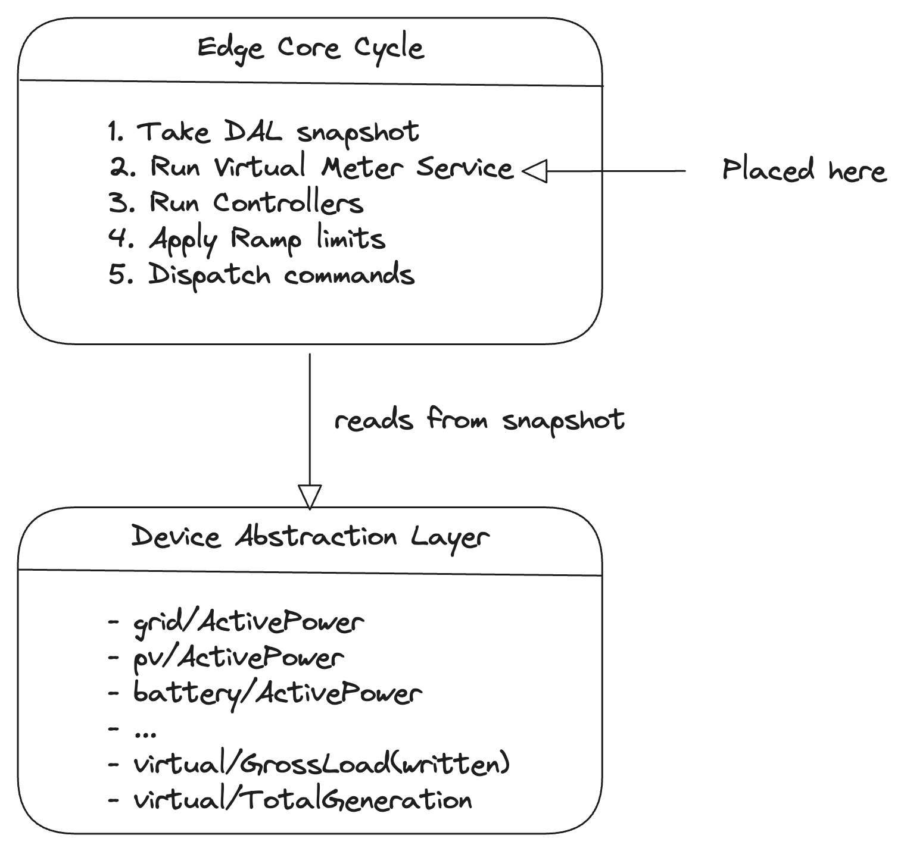

# Virtual Meter

## Purpose

A **Virtual Meter** is a software‑computed channel that derives meaningful energy values from one or more physical meters. It acts as a "soft sensor," providing additional insights without requiring extra hardware. In an EMS, virtual meters enable:

- **Gross load calculation** – determining the true site consumption when no dedicated load meter exists.
- **Total generation** – sum of all renewable sources (PV, wind) on site.
- **Self‑consumption** – the amount of solar power directly used by loads, rather than exported.
- **Site balance** – verification that the sum of generation, storage, and grid exchange matches consumption.

Virtual meters are essential for sites where physical meters are missing and for providing aggregated views to operators and controllers.

---

## Key Concepts

| Concept | Description |
|---------|-------------|
| **Virtual Meter** | A computed channel that aggregates or transforms existing physical meter channels. |
| **Gross Load** | The total electrical power consumed by on‑site equipment (lights, motors, HVAC). This is what a physical load meter would measure. |
| **Net Load** | The power that must be supplied by the grid after subtracting on‑site generation and battery charging/discharging. **Note:** Net load is exactly equal to `grid/ActivePower`. It does not need a virtual meter – it is already provided by the physical grid meter. |
| **Total Generation** | Sum of all on‑site generation sources (PV, wind, etc.). |
| **Self‑Consumption** | The portion of on‑site generation that is consumed by loads rather than exported. |
| **Site Balance** | A check that energy conservation holds – useful for detecting metering errors. |

---

## Standardized Virtual Meter Channels

Virtual meter channels reside in the **Device Abstraction Layer** and follow the naming convention `virtual/{channel_name}`. For example: `virtual/GrossLoad`, `virtual/TotalGeneration`.

| Channel Name | Unit | Description | Formula |
|--------------|------|-------------|---------|
| `GrossLoad` | W | Total site consumption. This is what a physical load meter would measure. | `grid/ActivePower + pv/ActivePower + wind/ActivePower - battery/ActivePower` (with battery power positive = charge) |
| `TotalGeneration` | W | Total on‑site renewable generation. | `pv/ActivePower + wind/ActivePower` |
| `SelfConsumption` | W | Power from generation that is consumed on‑site. | Simplified: `min(pv/ActivePower + wind/ActivePower, GrossLoad)`; or more accurately: `pv/ActivePower + wind/ActivePower - grid/ActivePower` when grid export is negative (requires careful sign handling). |
| `ExportPower` | W | Power exported to the grid (if grid meter is bidirectional). | `-grid/ActivePower` when grid power is negative (export) |
| `ImportPower` | W | Power imported from the grid. | `grid/ActivePower` when positive |
| `SiteBalance` | W | Residual indicating measurement inconsistency (should be near zero). | `grid/ActivePower + pv/ActivePower + wind/ActivePower + battery/ActivePower - GrossLoad` |
| `GrossLoad_Energy` | kWh | Accumulated gross load energy over time. | Integrated from `GrossLoad` |
| `Timestamp` | – | Time of last update (added by DAL). | Inherited from source channels |

**Note for MVP:** Focus on `GrossLoad` and `TotalGeneration`. Other channels can be added as needed.

---

## How It Fits into the DAL

Virtual meters are implemented as a **Virtual Meter Service** that runs as part of the **Edge Core Cycle**. The service:

1. **Executes immediately after the DAL snapshot is taken** and **before any controllers run**.
2. Reads relevant input channels from the snapshot (e.g., `grid/ActivePower`, `pv/ActivePower`, `battery/ActivePower`).
3. Computes derived values using the formulas above.
4. Writes the results back to the DAL as **new input channels** (under the `virtual/` namespace).



**Critical:** The virtual meter service must run **sequentially within the core cycle**, not as a separate thread. This ensures that all controllers see a consistent snapshot that includes the newly computed virtual channels. Running as a separate thread would violate the atomic snapshot guarantee.

---

## Integration with Controllers

Controllers can use virtual meter channels just like physical ones. For example:

- **Self‑consumption controller** might use `virtual/GrossLoad` to understand site demand when no physical load meter exists.
- **Peak shaving controller** could use `virtual/TotalGeneration` to anticipate available solar power.
- **Alarm engine** can monitor `virtual/SiteBalance` to detect metering errors.

---

## Energy Integration

For energy‑based virtual channels (e.g., `GrossLoad_Energy`), the service must integrate power over time:

```
Energy_kWh = Previous_Energy_kWh + (Power_kW * (Cycle_Duration_Seconds / 3600))
```

Where:
- `Power_kW` is the current `GrossLoad` value in kilowatts.
- `Cycle_Duration_Seconds` is the actual time elapsed since the last cycle (typically the core cycle period, but should be measured to account for jitter).
- The result is written back to the DAL as a new channel (e.g., `virtual/GrossLoad_Energy`).

This integration must handle counter rollover gracefully (e.g., using 64‑bit integers or detecting resets).

---

## Simulation Mode

During development, virtual meters can be tested using simulated source channels. For example:

- A simulated PV inverter produces `pv/ActivePower` from a profile.
- A simulated grid meter produces `grid/ActivePower`.
- The virtual meter service computes `virtual/GrossLoad`, which can be verified against expected values.

This allows end‑to‑end testing of controllers that depend on derived values without needing a full set of physical meters.

---

## Sign Convention

Virtual meters must respect the sign conventions of their source channels:

- **Grid power:** positive = import, negative = export.
- **PV/wind power:** positive = generation.
- **Battery power:** positive = charging, negative = discharging.
- **Load (gross):** always positive (consumption).

The formulas in Section 3 assume these conventions. Any deviation will produce incorrect results.

All virtual meter channels should maintain the same timestamp as the most recent source update (or the time of computation). If source timestamps differ significantly, the service may use the oldest timestamp or mark the result as `STALE`.

---

## Example: End‑to‑End Flow

**Scenario:** A site has a Grid Meter and a PV Inverter, but **no physical Load Meter**. We need to know how much power the building is consuming to display on the dashboard and use in controllers.

1. **Physical devices** update DAL:
   - `grid/ActivePower = +3000` (importing 3 kW from grid)
   - `pv/ActivePower = +5000` (generating 5 kW solar)
   - `battery_1/ActivePower = 0` (battery idle)

2. **Edge Core Cycle** begins:
   - Takes a snapshot of all DAL channels.

3. **Virtual Meter Service** runs (first step after snapshot):
   - Calculates gross load: `GrossLoad = grid + pv - battery`
   - `GrossLoad = 3000 + 5000 - 0 = 8000 W`
   - Updates DAL: `virtual/GrossLoad = 8000`

4. **Controllers** run next (e.g., self‑consumption controller):
   - They read `virtual/GrossLoad = 8000` and `pv/ActivePower = 5000`
   - Compute deficit = 3000 W, decide to discharge battery if needed.

5. **UI** subscribes to DAL updates and displays `virtual/GrossLoad = 8 kW` as the site consumption, even though no physical load meter exists.

This demonstrates how a virtual meter fills the gap of a missing physical meter, enabling both monitoring and control.

---

## Important Notes

- **Data quality:** Virtual meters are only as good as their source channels. If a source channel is stale or erroneous, the derived value will be too. Consider adding quality flags that combine source qualities (e.g., if any source is `STALE`, mark derived as `STALE`).
- **Execution order:** The virtual meter service **must** run immediately after the snapshot is taken and **before** any controllers. This ensures controllers see a consistent view that includes virtual channels. Running it as a separate thread would violate the atomic snapshot rule.
- **Energy integration:** When implementing energy accumulation, use the actual cycle duration (which may vary slightly) rather than assuming exactly 1 second. This prevents drift over time.
- **Configuration:** Which virtual meters are enabled may be site‑specific and configurable via `config.json` or cloud sync. For MVP, a fixed set (at least `GrossLoad` and `TotalGeneration`) is sufficient.
- **Circular dependencies:** Avoid creating virtual meters that depend on other virtual meters in a way that creates cycles. The service should have a defined order of computation if multiple virtual meters are present.

---