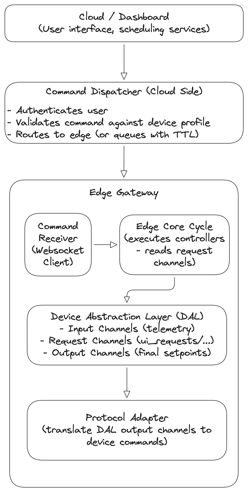

# Command Dispatcher

## Purpose

The **Command Dispatcher** is the component responsible for routing **user-initiated commands** (manual overrides, setpoints, mode changes) from the cloud UI to the appropriate edge device, and ensuring they are safely integrated with the control system. It also handles commands generated by automated cloud services (e.g., schedules, demand response events).

Key design principles:

- **Safety first:** Commands must never bypass the active control logic. They are treated as **requests** that are validated and executed by the appropriate controller during the next core cycle.

- **Validation at multiple levels:** Commands are checked against device profiles (access rights, static limits, dynamic limits) before reaching the edge.

- **Reliable delivery:** Commands are queued for offline edges with strict time‑to‑live (TTL) to avoid acting on stale requests.

---

## Role in the EMS Architecture

The Command Dispatcher sits at the boundary between the cloud and the edge, and also between the edge’s internal controllers and the device abstraction layer.



Key architectural points:
- **Request channels** (e.g., `ui_requests/battery_1_power`) hold raw user commands.
- Controllers read these requests, validate them against current system state, and then write to final output channels.
- The Command Dispatcher **never writes directly to output channels** – it only writes to request channels.

---

## Key Concepts

| Concept | Description |
|---------|-------------|
| **Command** | A request to change the state of a device or system. |
| **Setpoint** | A numeric command (e.g., battery power) – written to a request channel. |
| **Request Channel** | A dedicated DAL channel where user‑initiated commands are stored (e.g., `ui_requests/battery_1_power`). Controllers read these during each cycle. |
| **Manual Override** | A temporary command that takes precedence over automatic control, handled by a dedicated controller. |
| **Command Queue** | A buffer for offline edges. Commands are delivered when the edge reconnects, but with strict TTL. |
| **Command Expiry (TTL)** | Commands (especially power setpoints) expire after a short time (e.g., 60 seconds) to avoid acting on stale requests after reconnection. |
| **Idempotency** | Duplicate commands with the same `command_id` are silently dropped. |
| **Acknowledgment** | A two‑stage response: immediate receipt confirmation, followed by final status (executed/rejected/failed). |
| **Rejection** | When a command is syntactically valid but logically refused (e.g., SOC too low), a `rejected` acknowledgment is sent. |
| **Device Profile** | A JSON document defining channels, access rights, and validation rules. Used for pre‑validation. |

---

## Functional Requirements

### 1. Cloud‑Side Command Dispatcher

- Accept commands via secure WebSocket from authenticated UI clients.

- Validate user permissions: user must have `can_control` permission for the target edge/site.

- Validate basic command format and **check against device profile**:<br>• Channel must be writable (`access` field).<br>• If numeric, value must satisfy `static_min`/`static_max`.<br>• If enum, value must be in `allowed_values`.<br>• If dynamic limits are defined (`dynamic_min_channel`/`dynamic_max_channel`), fetch latest telemetry values from database/DAL and compute effective limits; reject if out of bounds.

- If target edge is online, forward command immediately via its persistent WebSocket connection.

- If target edge is offline, store command in a Redis queue **with a strict time‑to‑live (TTL) based on command type**:<br>• **Power setpoints and manual overrides:** TTL ≤ 60 seconds.<br>• **Configuration updates and schedule changes:** TTL ≤ 24 hours (or longer).<br>Commands that expire are discarded and marked as failed (timeout).

- Rate‑limit commands per user/edge to prevent abuse (e.g., max 10 commands per second).

- Log all commands (who, what, when, result) for audit and troubleshooting.

- Provide acknowledgment feedback to the UI (success, failure, rejected, queued).

### 2. Edge‑Side Command Receiver

- Maintain persistent WebSocket connection to cloud (with auto‑reconnect).
- On receipt of a command, validate that the target device exists and that a corresponding **request channel** is defined (e.g., `ui_requests/battery_1_power`). Use locally cached device profiles.
- Maintain a small rolling cache of recently processed `command_id`s (e.g., last 50) to silently drop duplicate deliveries (idempotency).
- **For setpoints and overrides:** Write the value to the appropriate **request channel** in the DAL (e.g., `ui_requests/battery_1_power = 50000`). **Never write directly to output channels.**
- For controller mode changes (e.g., enable/disable peak shaving), update the scheduler configuration (this may also be done via a request channel).
- Send two‑stage acknowledgment back to cloud:<br>• **Immediate acknowledgment:** `status: "received"` as soon as the command is written to the request channel (or queued).<br>• **Final acknowledgment:** After the Core Cycle processes the request (within 1–2 seconds), send a follow‑up with final status (`executed`, `rejected`, `failed`).
- Log all commands locally (for audit when cloud unreachable).

---

## Command Flow

### 1. User Initiates Command
- Operator clicks "Set Battery Charge 50kW" in the Next.js dashboard.
- UI sends JSON payload over WebSocket:

```json
{
  "command_id": "cmd_12345",
  "type": "setpoint",
  "target": {
    "edge_id": "site1_edge",
    "device_id": "battery_1",
    "channel": "RequestedActivePower",
    "value": 50000,
    "unit": "W"
  },
  "expiry_sec": 60,
  "source": "user_456",
  "timestamp": "2026-02-20T10:30:00Z"
}
```

### 2. Cloud Validation (Multi‑Layer)
- FastAPI WebSocket server receives payload.
- Checks user authentication (JWT) and permission.
- Fetches device profile for `battery_1` from configuration repository.
- Validates:
  - `RequestedActivePower` exists and is writable.
  - Value within `static_min`/`static_max` (e.g., ±100kW).
  - If dynamic limits are defined, queries latest telemetry for `MaxChargePower` and `MaxDischargePower` from the time‑series database (or DAL cache). Rejects if 50kW exceeds current `MaxChargePower`.
  - If enum, checks allowed values.
- If any check fails, sends error response to UI with reason.

### 3. Routing & Offline Handling
- Looks up edge's active WebSocket connection (connection registry).
- If online, forwards command immediately.
- If offline, stores in Redis queue with key `edge:site1_edge:commands` as a list. Each command is stored with a TTL equal to `expiry_sec` (capped at profile‑defined max). When edge reconnects, queued commands are delivered in order; expired commands are discarded and logged as failed (timeout).

### 4. Edge Receives and Validates (Lightweight)
- Edge's WebSocket client receives command.
- Checks `command_id` against a rolling cache of recent IDs; if duplicate, silently drop (idempotency).
- Uses locally cached device profile to verify that `RequestedActivePower` is a writable request channel.
- If invalid, sends rejection with reason.

### 5. Writing to Request Channel
- Edge writes the value to the DAL request channel:
  ```python
  DAL.set_channel("ui_requests/battery_1_power", 50000, timestamp)
  ```
- The request channel is an **input channel** from the perspective of controllers – it holds the user's desired value until consumed.

### 6. Immediate Acknowledgment
- Edge sends back:
  ```json
  { "command_id": "cmd_12345", "status": "received" }
  ```

### 7. Core Cycle Processing
- During the next Edge Core Cycle (every 1 second), the active controller (e.g., a `ManualOverrideController` or the main `BalancingController`) reads all relevant request channels.
- The controller validates the request against current system state:
  - Is SOC within safe range for this command?
  - Is requested power within current `MaxChargePower`/`MaxDischargePower` (dynamic limits from BMS)?
  - Does any other constraint (e.g., grid code) forbid this action?
- If valid, the controller writes the final setpoint to the output channel (e.g., `battery_1/SetActivePower`).
- If invalid, the controller logs the rejection and may write a rejection reason to a separate channel.

### 8. Final Acknowledgment
- After processing (within the same cycle or next), the edge sends a follow‑up acknowledgment:

```json
{
  "command_id": "cmd_12345",
  "status": "executed",  // or "rejected", "failed"
  "reason": "Battery SOC too low for requested discharge", // if rejected
  "executed_at": "2026-02-20T10:30:01.050Z"
}
```

- The cloud relays this to the UI, updating command status.

### 9. Expired Commands
- If a command expires in the queue (TTL exceeded), the cloud discards it and sends a final acknowledgment to the UI with `status: "failed"` and `reason: "timeout"`.

---

## Command Types and TTL Guidelines

| Type | Description | Request Channel Example | TTL |
|------|-------------|------------------------|-----|
| **setpoint** | Request to change a device output (power, current, etc.) | `ui_requests/battery_1_power` | ≤ 60s |
| **mode_change** | Enable/disable a controller or override mode | `ui_requests/controller_peak_shaving_enable` | ≤ 60s |
| **config_override** | Temporarily change a parameter (e.g., peak shaving threshold) | `ui_requests/peak_shaving_threshold` | ≤ 60s |
| **system** | Edge lifecycle commands (restart, sync config) | (special handling) | Immediate |
| **schedule_update** | Update a scheduled tariff or forecast | `ui_requests/tariff_schedule` | ≤ 24h |

---

## Integration with Other Components

| Component | Interaction |
|-----------|-------------|
| **Device Profiles** | Provide validation rules (access, static limits, dynamic limit channels). |
| **Device Abstraction Layer (DAL)** | Holds request channels (written by edge receiver) and output channels (written by controllers). |
| **Edge Core Cycle & Controllers** | Controllers read request channels during each cycle, validate, and write final setpoints. |
| **Protocol Adapters** | Read output channels from DAL and translate to device‑specific commands. |
| **Cloud Authentication (Django)** | Provides user permissions and session validation. |
| **Telemetry Database** | Stores dynamic limit values (e.g., `MaxChargePower`) used by cloud‑side validation. |
| **Edge Configuration Sync** | Delivers device profiles to the edge. |

---

## Metrics & Acceptance Criteria

| Metric | Target | How Measured |
|--------|--------|--------------|
| **Command round‑trip time** | < 500 ms (UI → cloud → edge → ack) | Instrumented end‑to‑end timing |
| **Offline command delivery** | 100% of non‑expired commands delivered when edge reconnects | Test with simulated disconnect |
| **Expiry enforcement** | 100% of expired commands discarded | Test with long offline period |
| **Validation accuracy** | 100% of invalid commands rejected with clear reason | Unit tests against device profiles |
| **Idempotency** | No duplicate execution of same `command_id` | Test with retransmission |
| **Queue capacity** | ≥ 1000 commands per edge | Stress test |

---

## Implementation Notes

- **Request channel naming:** Use a consistent prefix like `ui_requests/` followed by the logical target, e.g., `ui_requests/battery_1_power`, `ui_requests/peak_shaving_enable`. This keeps them clearly separate from telemetry channels.
- **Rolling cache for idempotency:** A simple in‑memory deque of last 50 command IDs, with timestamps; entries older than 5 minutes can be evicted.
- **Cloud side:** Use FastAPI WebSocket with Redis for connection registry and offline queue. For each edge, store commands in a Redis list with per‑message TTL (using `EXPIRE` on the list or storing each command as a separate key with TTL).
- **Edge side:** Python `websockets` library with asyncio. Maintain a single connection with auto‑reconnect.
- **Command ID:** Use UUID to ensure global uniqueness.
- **Security:** All WebSocket communication over WSS (TLS). Edge authenticates with API key on connection.
- **Dynamic limit validation in cloud:** For commands with dynamic limits, the cloud must have access to recent telemetry. This can be achieved by querying the time‑series database or a Redis cache of latest values.

---