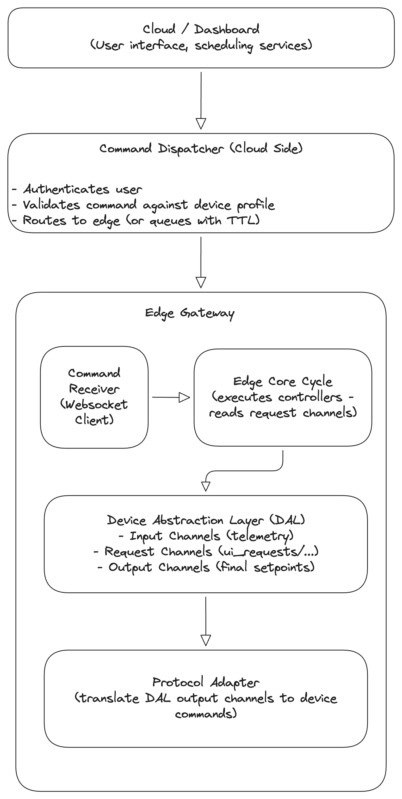

# Command Dispatcher

## Purpose

The **Command Dispatcher** is the component responsible for routing **user-initiated commands** (manual overrides, setpoints, mode changes) from the cloud UI to the appropriate edge device, and ensuring they are safely integrated with the control system. It also handles commands generated by automated cloud services (e.g., schedules, demand response events).

In essence, it is the **downlink** counterpart to telemetry uplink: telemetry flows from edge to cloud, commands flow from cloud to edge.

### Why It Matters

Without a robust command dispatcher:
- **Safety hazards:** Commands could bypass control logic and directly write to hardware output channels, potentially causing overvoltage, overcurrent, or equipment damage.
- **Conflicts:** Manual overrides could clash with automated controllers (peak shaving, balancing) leading to unpredictable behavior.
- **Lost commands:** If the edge goes offline, commands could be lost or, worse, delivered hours later when the situation has changed.
- **Poor user experience:** Users would have no feedback on whether their command was received, validated, or executed.

The Command Dispatcher solves these problems by providing a structured, multi‑layer validation and delivery system.

---

## Key Design Principles

| Principle | Description |
|-----------|-------------|
| **Safety first** | Commands must never bypass active control logic. They are treated as **requests** that are validated and executed by the appropriate controller during the next core cycle. |
| **Validation at multiple levels** | Commands are checked against device profiles (access rights, static limits, dynamic limits) before reaching the edge. |
| **Reliable delivery** | Commands are queued for offline edges with strict time‑to‑live (TTL) to avoid acting on stale requests. |
| **Idempotency** | Duplicate commands with the same `command_id` are silently dropped. |
| **Traceability** | Every command is logged with a unique ID, allowing end‑to‑end tracking across cloud, edge, and hardware. |

---

## High‑Level Architecture

The Command Dispatcher spans both cloud and edge, with clear separation of concerns.

### Key Components

| Component | Location | Responsibility |
|-----------|----------|----------------|
| **Cloud‑Side Dispatcher** | Cloud (FastAPI) | Accepts commands from UI, authenticates users, validates against device profiles, routes to online edges, queues for offline edges. |
| **Edge‑Side Receiver** | Edge (Python) | Maintains persistent WebSocket connection to cloud, receives commands, writes to request channels, sends acknowledgments. |
| **Request Channels** | DAL (Edge) | Temporary storage for user commands (e.g., `ui_requests/battery_1_power`). Written by edge receiver, read by controllers. |
| **Core Cycle Controllers** | Edge | Read request channels, validate against current system state, write final setpoints to output channels. |
| **Device Profiles** | Cloud + Edge | JSON definitions of device capabilities, limits, and writable channels. Used for validation. |

---

## Core Concepts

| Concept | Description |
|---------|-------------|
| **Command** | A request to change the state of a device or system. Examples: `set battery power to 5kW`, `enable peak shaving controller`. |
| **Setpoint** | A numeric command (e.g., battery power) – written to a request channel. |
| **Request Channel** | A dedicated DAL channel where user‑initiated commands are stored (e.g., `ui_requests/battery_1_power`). Controllers read these during each cycle. |
| **Manual Override** | A temporary command that takes precedence over automatic control, handled by a dedicated controller. |
| **Command Queue** | A buffer (Redis) for offline edges. Commands are delivered when the edge reconnects, but with strict TTL. |
| **Command Expiry (TTL)** | Commands expire after a defined time. Power setpoints have short TTL (≤60s); configuration updates may have longer TTL (≤24h). |
| **Idempotency** | Duplicate commands with the same `command_id` are silently dropped. |
| **Acknowledgment** | Two‑stage response: immediate receipt confirmation, followed by final status (executed/rejected/failed). |
| **Rejection** | When a command is syntactically valid but logically refused (e.g., SOC too low), a `rejected` acknowledgment is sent. |
| **Device Profile** | A JSON document defining channels, access rights, and validation rules. Used for pre‑validation. |

---

You're absolutely right. That clarification is important for the frontend team to understand the timeout behavior and ensure the UI doesn't hang indefinitely waiting for a response that will never come.

Here's the refined **Section 5** with your suggested change:

---

## Command Lifecycle Overview

1. **User Initiation** – User clicks a button in the UI; a JSON payload is sent over WebSocket.
2. **Cloud Validation** – Cloud dispatcher authenticates user, checks permissions, and validates against device profile (static limits, dynamic limits).
3. **Routing / Queueing** – If edge is online, command is forwarded immediately. If offline, stored in Redis queue with TTL.
4. **Edge Reception** – Edge receiver validates device existence and request channel; checks idempotency cache.
5. **Write to Request Channel** – Command value is written to the corresponding request channel in DAL (e.g., `ui_requests/battery_1_power`).
6. **Immediate Acknowledgment** – Edge sends `status: "received"` back to cloud.
7. **Core Cycle Processing** – During the next cycle, controllers read request channels, validate against current state (SOC, limits), and decide whether to execute.
8. **Final Acknowledgment** – Edge sends `executed`, `rejected`, or `failed` status back to cloud.
9. **User Feedback** – Cloud relays final status to UI, updating the user on command outcome.

**If a command expires in the offline queue (TTL exceeded), the Cloud Dispatcher discards it and actively broadcasts a `failed: timeout` status back to the UI, ensuring the frontend never hangs indefinitely waiting for a response.**

---

This change makes the timeout behavior explicit and sets clear expectations for the UI team. Everything else in the document is solid and ready for publishing.

---

## What This Document Covers

This overview is the entry point to the Command Dispatcher documentation. The following detailed topics are covered in separate documents:

| # | Topic | Description |
|---|-------|-------------|
| 1 | **Command Dispatcher Overview** | (This document) High‑level introduction and architecture. |
| 2 | **Cloud‑Side Dispatcher Service** | WebSocket server, authentication, validation, routing, offline queuing. |
| 3 | **Edge‑Side Dispatcher Service** | WebSocket client, auto‑reconnect, idempotency cache, request channel writes. |
| 4 | **Request Channels** | Naming convention, purpose, mapping from device profiles. |
| 5 | **Command Validation** | Static limits, dynamic limits, enum validation using device profiles. |
| 6 | **Offline Command Queue and TTL** | Redis queue design, TTL policies, expiry handling. |
| 7 | **Acknowledgment Flow** | Two‑stage acknowledgment, payload schemas, success/rejection/failure. |
| 8 | **Security and Rate Limiting** | Authentication, authorization, rate limiting, WSS/TLS. |
| 9 | **Controller Consumption & Arbitration** | How controllers read request channels, resolve conflicts, and prioritize manual overrides. |
| 10 | **Command Payload Schemas (API Contract)** | Exact JSON structures for each command type (setpoint, mode_change, etc.). |
| 11 | **Audit Logging & Command Traceability** | Logging `command_id` across cloud, queue, edge, DAL for debugging. |

---

## Integration with Other EMS Components

| Component | Interaction |
|-----------|-------------|
| **Device Profiles** | Provide validation rules (access, static limits, dynamic limit channels). |
| **Device Abstraction Layer (DAL)** | Holds request channels (written by edge receiver) and output channels (written by controllers). |
| **Edge Core Cycle & Controllers** | Controllers read request channels during each cycle, validate, and write final setpoints. |
| **Protocol Adapters** | Read output channels from DAL and translate to device‑specific commands. |
| **Cloud Authentication (Django)** | Provides user permissions and session validation. |
| **Telemetry Database** | Stores dynamic limit values (e.g., `MaxChargePower`) used by cloud‑side validation. |
| **Edge Configuration Sync** | Delivers device profiles to the edge. |

---

## Summary

The Command Dispatcher is the safety‑critical bridge between user intent and physical action. By introducing:

- **Request channels** that prevent commands from bypassing control logic,
- **Multi‑layer validation** using device profiles (static and dynamic limits),
- **Strict TTLs** for offline queuing,
- **Idempotency** and two‑stage acknowledgments,
- **Clear arbitration rules** between manual and automatic control,

the dispatcher ensures that every command is validated against both hardware capabilities and current system state before execution. This design eliminates race conditions, prevents dangerous stale commands, and gives users clear feedback on the outcome of their requests.

---