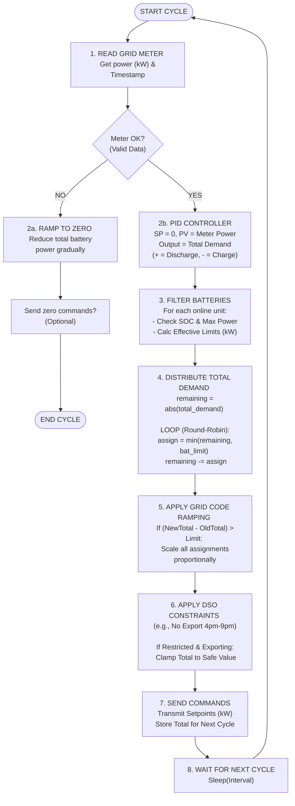

We have represented the self consumption logic of ems controller 

```mermaid
flowchart TD
    %% Define styles for clarity
    classDef process fill:#e3f2fd,stroke:#1565c0,stroke-width:2px;
    classDef decision fill:#fff9c4,stroke:#fbc02d,stroke-width:2px;
    classDef terminator fill:#ffccbc,stroke:#bf360c,stroke-width:2px,rx:10,ry:10;
    classDef error fill:#ffcdd2,stroke:#c62828,stroke-width:2px;

    %% Start
    Start([START CYCLE]) --> Step1
    style Start terminator

    %% Step 1
    Step1["1. READ GRID METER <br/> Get power (kW) & Timestamp"] --> CheckMeter
    style Step1 process

    %% Decision
    CheckMeter{"Meter OK? <br/> (Valid Data)"}
    style CheckMeter decision

    %% --- FAIL PATH ---
    CheckMeter -- NO --> Step2a
    Step2a["2a. RAMP TO ZERO <br/> Reduce total battery power gradually"] --> Step2aOpt
    style Step2a error

    Step2aOpt["Send zero commands? <br/> (Optional)"] --> EndError
    style Step2aOpt error

    EndError([END CYCLE])
    style EndError terminator

    %% --- SUCCESS PATH ---
    CheckMeter -- YES --> Step2b

    %% Step 2b: PID
    Step2b["2b. PID CONTROLLER <br/> SP = 0, PV = Meter Power <br/> Output = Total Demand <br/> (+ = Discharge, - = Charge)"] --> Step3
    style Step2b process

    %% Step 3: Battery Limits
    Step3["3. FILTER BATTERIES <br/> For each online unit: <br/> - Check SOC & Max Power <br/> - Calc Effective Limits (kW)"] --> Step4
    style Step3 process

    %% Step 4: Distribution Logic
    Step4["4. DISTRIBUTE TOTAL DEMAND <br/> remaining = abs(total_demand) <br/> <br/> LOOP (Round-Robin): <br/> assign = min(remaining, bat_limit) <br/> remaining -= assign"] --> Step5
    style Step4 process

    %% Step 5: Ramping
    Step5["5. APPLY GRID CODE RAMPING <br/> If (NewTotal - OldTotal) > Limit: <br/> Scale all assignments proportionally"] --> Step6
    style Step5 process

    %% Step 6: DSO Constraints
    Step6["6. APPLY DSO CONSTRAINTS <br/> (e.g., No Export 4pm-9pm) <br/> <br/> If Restricted & Exporting: <br/> Clamp Total to Safe Value"] --> Step7
    style Step6 process

    %% Step 7: Send
    Step7["7. SEND COMMANDS <br/> Transmit Setpoints (kW) <br/> Store Total for Next Cycle"] --> Step8
    style Step7 process

    %% Step 8: Wait & Loop
    Step8["8. WAIT FOR NEXT CYCLE <br/> Sleep(Interval)"] --> Start
    style Step8 process
```
