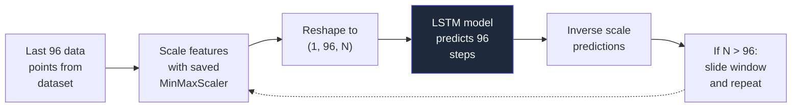

# Load Demand Forecasting — LSTM Model

## Overview

The load demand forecasting model predicts **total grid electricity consumption (kW)** for future time steps at **15-minute intervals**. It uses a **Multi-Step LSTM (Long Short-Term Memory)** neural network, which is a type of recurrent deep learning architecture specifically designed for sequential time-series data.

---

## Why LSTM for Load Demand?

### The Core Problem

Electricity demand is **inherently sequential** — the load at 2:15 PM is strongly influenced by the load at 2:00 PM, 1:45 PM, and the pattern from the same time yesterday. This makes it a **time-series forecasting problem** where the order and temporal context of data points matter.

### Why LSTM Excels Here

| Property | Why It Matters for Load Forecasting |
|----------|-------------------------------------|
| **Sequential memory** | LSTM cells maintain a "memory state" that remembers patterns from hundreds of previous time steps — critical for capturing daily load cycles (peak at noon, trough at 3 AM) |
| **Multi-step output** | A single forward pass predicts 96 future steps (24 hours at 15-min intervals), avoiding error compounding from single-step recursive prediction |
| **Non-linear temporal learning** | Load demand has complex interactions — weekday vs weekend patterns, seasonal shifts, weather effects — that LSTMs learn implicitly from the sequence |
| **Variable-length dependencies** | LSTM's gating mechanism (forget gate, input gate, output gate) lets it decide which past information is relevant and which to discard |

### Why Not Other Algorithms?

| Algorithm | Problem for Load Demand |
|-----------|------------------------|
| **XGBoost / Random Forest** | Cannot model sequential dependencies — treats each row independently, losing the temporal context that's essential for load patterns |
| **Linear Regression** | Cannot capture non-linear patterns (e.g., sudden spikes during heat waves) |
| **ARIMA / Prophet** | Work well for single-step forecasting but struggle with multi-step (96-step) prediction and multi-feature inputs |
| **Transformer** | Could work but requires significantly more data and training time; LSTM is more practical for this dataset size |

---

### Architecture Details

| Layer | Configuration | Purpose |
|-------|--------------|---------|
| **LSTM 1** | 128 units, `return_sequences=True` | Extracts temporal patterns from the 96-step input window; returns full sequence for the next LSTM layer |
| **Dropout 1** | 20% rate | Prevents overfitting by randomly deactivating neurons during training |
| **LSTM 2** | 64 units | Compresses the temporal representation into a fixed-size vector; extracts higher-level patterns |
| **Dropout 2** | 20% rate | Additional regularization |
| **Dense 1** | 128 units, ReLU activation | Non-linear transformation to map temporal features to prediction space |
| **Dense 2 (Output)** | 96 units, linear activation | Outputs 96 predicted load values (one per time step) |

### Training Configuration

| Parameter | Value | Rationale |
|-----------|-------|-----------|
| **Optimizer** | Adam (lr=0.0005) | Adaptive learning rate; lower lr prevents overshooting |
| **Gradient Clipping** | clipnorm=1.0 | Prevents exploding gradients common in LSTM training |
| **Loss Function** | MSE (Mean Squared Error) | Standard for regression; penalizes large errors more than MAE |
| **Batch Size** | 256 | Balances training speed and gradient stability |
| **Epochs** | 50 (max) | Upper limit; early stopping usually triggers earlier |
| **Early Stopping** | patience=8, restore_best_weights | Stops training when validation loss plateaus; restores the best model |
| **Validation Split** | 10% of training data | Monitors for overfitting during training |
| **Train/Test Split** | 80/20 (chronological) | Time-series split preserves temporal order — no data leakage |

---

## Feature Engineering

### Input Features

| Feature | Source | Type | Purpose |
|---------|--------|------|---------|
| `Load Demand (kW)` | Raw data | Target | The value being predicted |
| `Season` | Raw data | Categorical → Encoded | Captures seasonal demand patterns (heating in winter, cooling in summer) |
| `Weather Condition` | Raw data | Categorical → Encoded | Weather impacts energy usage (rain, sunny, cloudy) |
| `hour_sin` | Derived | Cyclical | Sine component of hour-of-day (captures 24-hour cycle without discontinuity at midnight) |
| `hour_cos` | Derived | Cyclical | Cosine component of hour-of-day |
| Other numeric features | Raw data | Continuous | Temperature, humidity, etc. as available in the dataset |

### Cyclical Time Encoding

Instead of using raw hour values (0–23), we use **sine/cosine encoding**:

```python
hour_sin = sin(2π × hour / 24)
hour_cos = cos(2π × hour / 24)
```

> [!TIP]
> This is critical because raw hour values create a false discontinuity — hour 23 and hour 0 are actually 1 hour apart, but numerically appear 23 apart. Sine/cosine encoding preserves the circular nature of time.

### Scaling

| Component | Scaler | Why |
|-----------|--------|-----|
| Features (X) | MinMaxScaler (0–1) | LSTM performs best with normalized inputs; prevents features with large ranges from dominating |
| Target (y) | MinMaxScaler (0–1) | Ensures consistent gradient magnitudes during backpropagation |

### Sequence Creation

The model uses a **sliding window** approach:

```
Input window:  96 time steps (24 hours of data)
Output window: 96 time steps (next 24 hours prediction)

[t₁, t₂, ..., t₉₆] → [t₉₇, t₉₈, ..., t₁₉₂]
```

Each training sample is a pair: (96 input steps → 96 output steps), slid one step at a time across the dataset.

---

## Prediction Pipeline

### Multi-Step Forecasting Process



For predictions beyond 96 steps, the model uses **autoregressive rolling**:

1. Predict the next 96 steps
2. Append predicted values to the input window
3. Slide the window forward
4. Repeat until N total steps are predicted

> [!WARNING]
> Accuracy degrades with longer horizons because each subsequent prediction builds on previously predicted (not actual) values. This is an inherent limitation of autoregressive forecasting.

---

## Evaluation Metrics

| Metric | Description |
|--------|-------------|
| **MAE** (Mean Absolute Error) | Average absolute difference between predicted and actual values in kW |
| **RMSE** (Root Mean Squared Error) | Square root of average squared differences; penalizes large errors more |
| **MAPE** (Mean Absolute Percentage Error) | Percentage error relative to actual values |
| **R²** (R-Squared) | Proportion of variance explained by the model (1.0 = perfect) |
| **Accuracy** | Defined as `100 - MAPE`, provides an intuitive percentage |

---

## Model Files

| File | Description |
|------|-------------|
| `multistep_lstm.keras` | Trained LSTM model (TensorFlow/Keras format) |
| `scaler_X.save` | Feature scaler (MinMaxScaler, fitted on training features) |
| `scaler_y.save` | Target scaler (MinMaxScaler, fitted on load demand values) |
| `data_frequency.save` | Auto-detected data frequency (15 min) |
| `season_encoder.save` | LabelEncoder for the Season column |

---

## API Endpoint

```
POST /predict
Content-Type: application/json

Request:  { "n_steps": 96 }
Response: { "status": "success", "forecast": [{ "timestamp": "...", "load": 1500.23 }, ...] }
```

| Parameter | Type | Default | Description |
|-----------|------|---------|-------------|
| `n_steps` | int | 96 | Number of 15-min intervals to predict (96 = 24 hours) |
