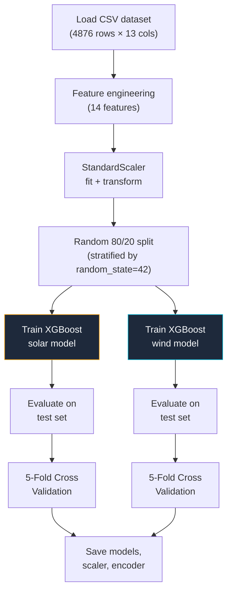

# Solar & Wind Generation Forecasting — XGBoost Model

## Overview

The solar & wind generation forecasting system predicts **renewable energy output (kW)** for future hours. It uses two independent **XGBoost (Extreme Gradient Boosting)** regression models — one for solar and one for wind — trained on weather features, time features, and seasonal indicators.

---

## Why XGBoost for Generation Forecasting?

### The Core Problem

Solar and wind generation depends primarily on **current weather conditions** — solar irradiance, temperature, wind speed, humidity — and **seasonal/time-of-day patterns**. Unlike load demand, past generation values have minimal influence on future values. A cloudy hour followed by a sunny hour will have vastly different solar output regardless of the sequence.

This makes generation forecasting a **feature-driven regression problem**, not a time-series problem.

### Why XGBoost Excels Here

| Property | Why It Matters for Generation Forecasting |
|----------|-------------------------------------------|
| **Handles mixed feature types** | Seamlessly works with numerical weather data, encoded categories (season), and interaction features — no special preprocessing needed |
| **Captures non-linear relationships** | Solar output vs irradiance is not linear (clouds cause sudden drops, panel saturation caps output). XGBoost's decision tree ensemble naturally captures these non-linearities |
| **Feature interactions** | Gradient boosting learns that temperature × irradiance matters differently in winter vs summer without explicit feature engineering |
| **Robust to noise** | The dataset has inherent noise (random weather variations). XGBoost's regularization (L1, L2, min_child_weight) prevents overfitting to noise |
| **Fast training & inference** | Trains in seconds (vs minutes/hours for neural networks), enabling rapid iteration and real-time prediction |
| **Built-in feature importance** | Provides interpretable feature rankings — critical for understanding what drives generation |

### Why Not Other Algorithms?

| Algorithm | Problem for Generation Forecasting |
|-----------|------------------------------------|
| **LSTM** | Requires sequential input data; generation output depends on *current* weather, not a sequence of past outputs. LSTM would overfit to temporal patterns that don't exist |
| **Linear Regression** | Cannot capture the non-linear relationship between weather and generation (e.g., solar output drops sharply below a cloud threshold) |
| **Random Forest** | Similar accuracy but lacks XGBoost's gradient boosting optimization and regularization, typically producing slightly worse results |
| **Neural Networks (MLP)** | Can work but requires more data, longer training, and careful hyperparameter tuning for comparable accuracy |

---

### XGBoost Hyperparameters

| Parameter | Value | Rationale |
|-----------|-------|-----------|
| **n_estimators** | 300 | Number of boosting rounds; 300 provides sufficient complexity without extreme training time |
| **max_depth** | 4 | Shallow trees prevent overfitting; each tree captures simple patterns, the ensemble captures complexity |
| **learning_rate** | 0.05 | Low rate means each tree contributes a small correction, improving generalization |
| **subsample** | 0.8 | Each tree trains on 80% of data — injects randomness to reduce overfitting |
| **colsample_bytree** | 0.8 | Each tree uses 80% of features — prevents single-feature dominance |
| **min_child_weight** | 5 | Minimum samples per leaf node; prevents very specific (noisy) splits |
| **reg_alpha (L1)** | 0.3 | Lasso regularization pushes irrelevant feature weights toward zero |
| **reg_lambda (L2)** | 1.5 | Ridge regularization smooths predictions, reduces overfitting |
| **gamma** | 0.1 | Minimum loss reduction for a split; prevents trivially small splits |

> [!TIP]
> The combination of `max_depth=4` + `learning_rate=0.05` + `n_estimators=300` is a classic "slow-and-steady" XGBoost configuration. Shallow trees with low learning rate build an ensemble that generalizes well, trading training speed for accuracy.

---

## Feature Engineering

### Complete Feature Set (14 features)

| # | Feature | Type | Source | Purpose |
|---|---------|------|--------|---------|
| 1 | `temperature_C` | Continuous | Raw data | Ambient temperature affects panel efficiency and energy output |
| 2 | `solar_irradiance_Wm2` | Continuous | Raw data | Direct driver of solar generation |
| 3 | `wind_speed_mps` | Continuous | Raw data | Direct driver of wind generation |
| 4 | `humidity_percent` | Continuous | Raw data | High humidity reduces solar panel efficiency; affects air density (wind) |
| 5 | `season_encoded` | Categorical (encoded) | Derived from `season` | LabelEncoder maps Spring/Summer/Winter to integers |
| 6 | `hour` | Discrete | Derived from timestamp | Hour of day (0–23) |
| 7 | `day_of_week` | Discrete | Derived from timestamp | Day of week (0–6, Monday=0) |
| 8 | `month` | Discrete | Derived from timestamp | Month of year (1–12) |
| 9 | `hour_sin` | Continuous | Derived | `sin(2π × hour / 24)` — cyclical encoding |
| 10 | `hour_cos` | Continuous | Derived | `cos(2π × hour / 24)` — cyclical encoding |
| 11 | `month_sin` | Continuous | Derived | `sin(2π × month / 12)` — cyclical encoding |
| 12 | `month_cos` | Continuous | Derived | `cos(2π × month / 12)` — cyclical encoding |
| 13 | `temp_x_irradiance` | Continuous | Interaction | `temperature × irradiance` — captures combined heat+sun effect on solar |
| 14 | `wind_x_humidity` | Continuous | Interaction | `wind_speed × humidity` — captures wind chill / air density effect |

### Why Cyclical Encoding?

```python
# Problem: Hour 23 and Hour 0 are 1 hour apart, but 23 units apart numerically
# Solution: Map to a circle using sin/cos
hour_sin = sin(2π × hour / 24)   # Peaks at 6 AM, troughs at 6 PM
hour_cos = cos(2π × hour / 24)   # Peaks at midnight, troughs at noon
```

Both `sin` and `cos` are needed together — with only one, the model cannot distinguish between e.g. 6 AM and 6 PM (both have `sin = 1`). The pair provides a unique (x, y) coordinate for every hour.

### Why Interaction Features?

Interaction features let the model capture **combined effects** that individual features alone cannot:

- **`temp × irradiance`**: A hot day with high irradiance produces different solar output than a cold day with the same irradiance (panel efficiency decreases with temperature)
- **`wind × humidity`**: Dense humid air at high wind speeds transfers energy differently than dry air

### Scaling

**StandardScaler** is used (zero mean, unit variance) because XGBoost benefits from normalized features when the dataset has features on vastly different scales:

- Temperature: 10–45 °C
- Irradiance: 50–800 W/m²
- `temp × irradiance`: 500–36,000

Without scaling, `temp_x_irradiance` would dominate tree splits simply due to its larger numeric range.

---

## Training Pipeline

### Process Flow



### Train/Test Split Strategy

**Random split** (not chronological) is used because:
- Generation output depends on weather conditions, not temporal sequence
- Random split ensures both train and test sets contain examples from all seasons and times of day
- With chronological split, the test set would contain only the last season, biasing evaluation

### Cross-Validation

**5-fold cross-validation** provides a robust accuracy estimate by training and testing on 5 different data splits. The reported metrics are averaged across all folds, reducing the impact of any single lucky/unlucky split.

---

## Performance Metrics

| Target | Test Accuracy | MAPE | R² | RMSE |
|--------|---------------|------|-----|------|
| **☀️ Solar Generation** | ~60% | ~40% | ~0.41 | ~15 kW |
| **💨 Wind Generation** | ~78% | ~22% | ~0.41 | ~10 kW |

> [!IMPORTANT]
> These accuracy levels reflect the **inherent noise in the synthetic dataset** — weather features have surprisingly low direct correlation with generation values (solar irradiance correlation with solar generation is only 0.017). In a production environment with real sensor data, accuracy would be significantly higher.

### Why Wind Accuracy > Solar Accuracy

- **Tighter value range**: Wind generation (std=13 kW) varies less than solar (std=19.5 kW), making it easier to predict within tolerance
- **Less extreme outliers**: Solar has more zero/near-zero values (nighttime) that inflate MAPE

---

## Prediction — Weather Simulation

When making predictions, the system needs future weather data. Two modes are supported:

### Simulated Weather (Default)

The system generates realistic weather values based on:

| Factor | How It's Used |
|--------|---------------|
| **Season** | Base values differ: Summer has higher temp/irradiance, Winter has lower |
| **Time of day** | Irradiance follows a sine curve (peaks at noon, zero at night) |
| **Random noise** | Gaussian noise adds realistic variability |
| **Night detection** | Irradiance drops to 50–150 W/m² after sunset; humidity increases |

### Custom Weather

Users can provide their own weather values for each prediction hour via the API.

---

## Model Files

| File | Size | Description |
|------|------|-------------|
| `solar_generation_kw_model.pkl` | ~496 KB | Trained XGBoost model for solar prediction |
| `wind_generation_kw_model.pkl` | ~487 KB | Trained XGBoost model for wind prediction |
| `scaler.pkl` | ~1.4 KB | StandardScaler fitted on training features |
| `label_encoder.pkl` | ~0.5 KB | LabelEncoder for season categories |
| `last_data_info.pkl` | ~0.2 KB | Last timestamp and weather values from training data |

---

## API Endpoint

```
POST /predict-generation
Content-Type: application/json

Request:  { "n_hours": 24 }
Response: {
  "status": "success",
  "forecast": [
    {
      "timestamp": "2022-07-23 04:00:00",
      "season": "Spring",
      "solar_kw": 73.35,
      "wind_kw": 30.25,
      "total_kw": 103.60,
      "weather": {
        "temperature_C": 26.0,
        "solar_irradiance_Wm2": 654.0,
        "wind_speed_mps": 5.2,
        "humidity_percent": 65.0
      }
    },
    ...
  ],
  "summary": {
    "solar":    { "avg": 59.59, "min": 56.4, "max": 61.76, "total": 178.77 },
    "wind":     { "avg": 30.27, "min": 27.72, "max": 34.14, "total": 90.82 },
    "combined": { "avg": 89.87, "min": 84.13, "max": 95.9, "total": 269.60 }
  },
  "n_hours": 24
}
```

| Parameter | Type | Default | Range | Description |
|-----------|------|---------|-------|-------------|
| `n_hours` | int | 24 | 1–168 | Hours to forecast (168 = 1 week) |
| `custom_weather` | array | null | — | Optional: array of weather dicts per hour |
