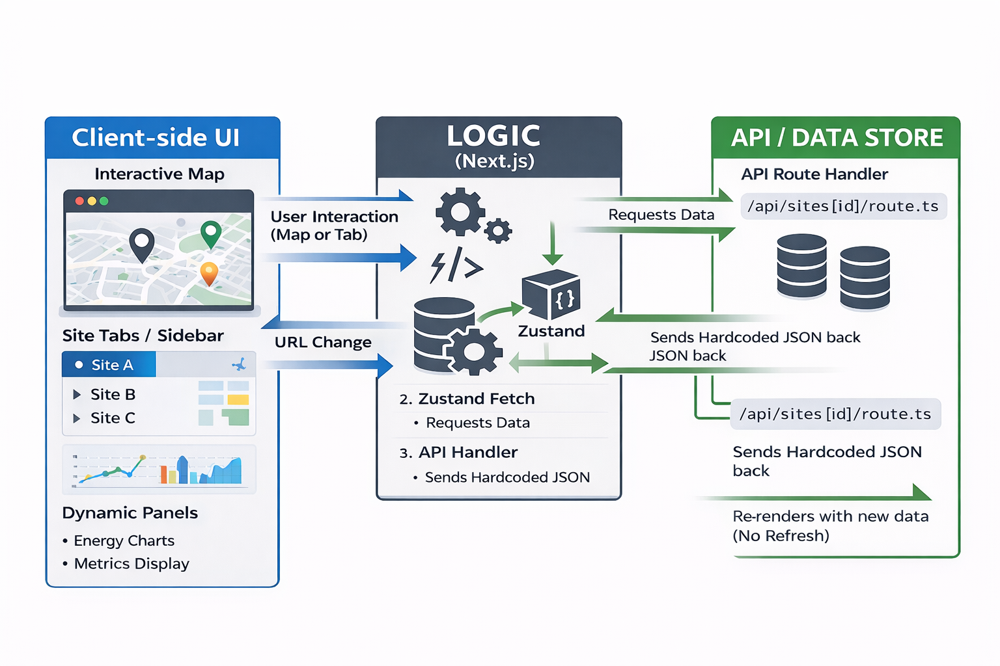

# **SiteMap Synchronization**

## **1\. Executive Summary**

The goal of this system is to provide a synchronized experience between the Interactive Map and the Dashboard UI Panels. To avoid hard refreshes, we utilize Zustand as a central state store that coordinates data between the UI and the Map, triggered by Next.js Dynamic Routing.

## **2\. System Architecture Logic**

The architecture follows a "Triangular Sync" pattern:

1. **The URL:** Acts as the primary trigger (/sites/\[siteId\]).  
2. **Zustand Store:** Acts as the data manager. It fetches data from the API and holds it in memory.  
3. **The Components:** The Map and UI "listen" to the Zustand store and update themselves automatically.

## **3\. Requirement Fulfillment**

### **Requirement 1: UI-to-Map (Tab/Sidebar Click)**

* **Action:** User clicks a "Site B" tab.  
* **Process:** 1\. The URL changes to /sites/site-b.  
  2\. A useEffect hook in the layout detects this change and calls the **Zustand Action** setActiveSite('site-b').  
  3\. Zustand fetches the hardcoded data from /api/sites/site-b.  
  4\. The **Map** is subscribed to Zustand; it sees the new coordinates and executes a smooth flyTo().  
* **Result:** The map pans to the new site without a page reload.

### **Requirement 2: Map-to-UI (Marker Click)**

* **Action:** User clicks a Site Marker on the map.  
* **Process:**  
  1. The Map triggers router.push('/sites/site-c').  
  2. The URL updates, which triggers the Zustand store to refresh.  
  3. The **UI Panels** (Energy Charts, Metrics) are subscribed to the Zustand store. They see the new data and re-render.  
* **Result:** The charts and site details update instantly to reflect the site clicked on the map.

## **4\. The "Just-in-Time" Data Flow (API Layer)**

To keep the frontend clean, we use **Next.js API Handlers**. This allows us to "hardcode" the data in a way that mimics a real database.

* **API Folder:** app/api/sites/\[siteId\]/route.ts  
* **Logic:** When Zustand requests data for an ID, the handler looks up the site in a local JSON object and returns it.

## **5\. Technical Benefits of Zustand in EMS**

| Feature | Benefit |
| :---- | :---- |
| **No Hard Refresh** | Maintains WebSocket/Real-time energy streams without interruption. |
| **Shared State** | The Map and UI always show the same site data because they read from the same store. |
| **Performance** | Only components using the specific "activeSite" data will re-render. |
| **Future Proof** | You can replace the hardcoded API with a live SQL database later without changing your Zustand logic. |
