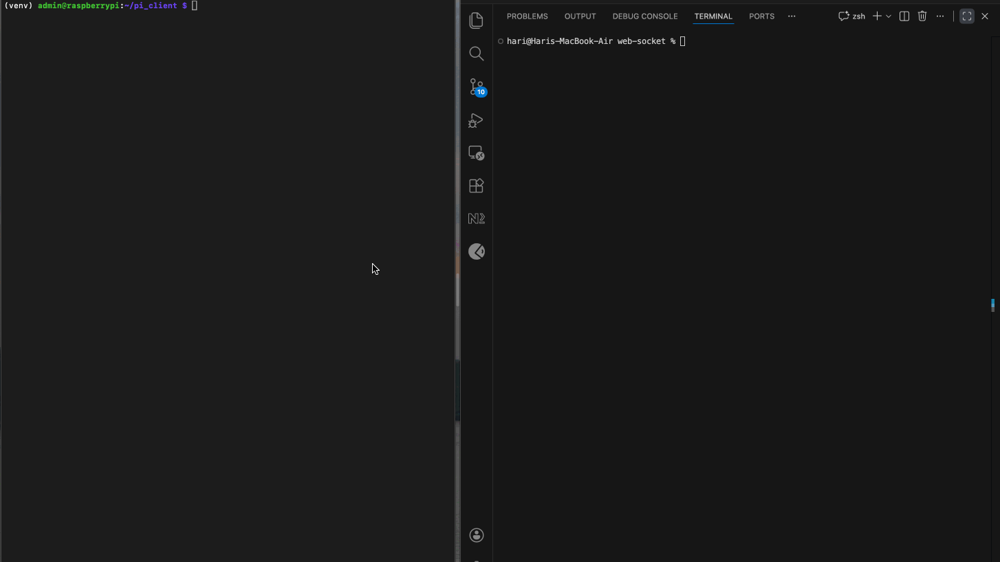

# EMS WebSocket Architecture & Developer Guide

## Overview

This service acts as the Real-Time Switchboard for the Energy Management System. It manages high-frequency telemetry from the Edge devices (Raspberry Pis) and broadcasts it to live Dashboards (React/Postman) while asynchronously persisting data to TimescaleDB.



### Core Design Principles
- **Pub/Sub Pattern**: Devices are publishers (Write-Only). Dashboards are Subscribers (Read-Only). They never communicate directly.

- **Async Forking**: Incoming data is split into two paths.
    - **Hot Path**: Immediate broadcast to the UI (Zero latency).
    - **Cold Path**: Background persistence to the DB (Allowed to lag).

- **One-Device-One-Connection**: A strict policy where a new connection from a device ID automatically kicks off any existing connection for that same ID ("Ghost Protocol").

## Component Reference

### A. Connection Manager (*connectionManager.py*)
This class is the "State Machine" of the server. It manages the registry of who is connected.

*class ConnectionManager*

- **Purpose**: Holds active websocket references and handles the dangerous logic of connection/disconnection without crashing the async loop.

- **Key Attribute**: *self.lock* (*asyncio.lock*) - **CRITICAL**. This lock serializes connection attempts. It ensures that checking for an old connection and registering a new one happens as a single atomic operation, preventing race conditions.

### Key Methods:

1. *connect_publisher(websocket, device_id)*
- **Role** Registers a Raspberry Pi.
- **Logic**:
    1. Accepts the network socket.
    2. Acquires self.lock.
    3. **Ghost Protocol**: Checks if *device_id* is already in *active_publishers*. If yes, it closes the old socket with *WS_1008_POLICY_VIOLATION*.
    4. **Atomic Write**: Overwrites the dictionary entry with the new socket.

2. *disconnect_publisher(device_id, websocket)*
- **Role** Safe cleanup.
- **Logic**: Includes an **Identity Check**. It only deletes the *device_id* from the dictionary if the socket requesting the disconnect is the current active socket. This prevents a "Zombie" (kicked) socket from deleting the entry of a brand-new connection.

3. *broadcast(message, device_id)*
- **Role**: The "Router".
- **Logic**: Looks up *active_subscribers* for the given ID and sends the message. It never sends data back to the *active_publishers* (Pi).

### B. Server Routes (*main.py*)
We use a "Two-Door" approach to seperate traffic sources.

1. **Device Door */ws/device/{device_id}***

- **Purpose**: Ingests raw telemetry.

- **Security**: Strict Header-based Auth (*Authorization: Bearer < token >*).

- **Flow**:
    1. **Gatekeeper**: Validates JSON against the *TelemetryData* Pydantic mode. Invalid data is dropped (log only), ensuring bad packets don't kill the connection.

    2. **Loop Protection**: Inside the *while True* loop, it checks if *manager.active_publishers[id] != self*. If the manager replaced this socket, the loop terminates immediately.

    3. **Forking**: Calls *manager.broadcast* await and *save_to_timescaledb* (create_task).

2. **Dashboard Door**: */ws/dashboard/{device_id}*

- **Purpose**: Real-time data visualization.

- **Security**: Open (currently)/ Read-Only (as of now)

- **Flow**: Connects and sits in an idle *await receive_text()* loop just to keep the TCP connection alive. It processes no incoming data from the UI.

## Concurrency & Race Condition Handling

### Ghost Protocol - Race Condition

- **Problem**: If Device A disconnects and Device B connects at the exact same millisecond, standard logic might delete Device B's key or allow both to exist.

- **Solution (Implemented)**:
    1. **Atomic Locking**: We use *async with self.lock*: around the entire connect/disconnect logic.

    2. **Identity Checks**: We never blind delete. We always check *if active_socket is websocket:* before removing.

    3. **Loop Self-Termination**: The publisher loop actively checks if it has been replaced and terminates if it detects it is no longer the active.

## Simulating a Device (Publisher)
Use the *simulation/client.py* script. It handles auth headers and auto-reconnection.

```bash
# Set ENV variables for security
export DEVICE_ID="ems_001"
export API_TOKEN="sBrIr9wSkn@d*]@z6"
python client.py
```

## Simulating a Dashboard (Subscriber)
Use Postman or a simple WebSocket client.

- **URL**: *ws://< SERVER_IP >:8000/ws/dashboard/ems_001*
- **Expected Behaviour**: You will receive JSON streams. Sending data to this socket will have no effect.

**Note**: Later this can be replaced with actual simulation logic with Inverter, Grid, Solar and Battery (BMS).