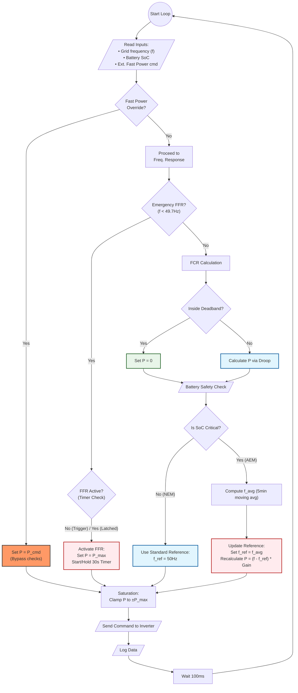

Grid Support ems controller diagram 

```mermaid
graph TD
    %% Styling
    classDef override fill:#f96,stroke:#333,stroke-width:2px;
    classDef logic fill:#e1f5fe,stroke:#01579b,stroke-width:2px;
    classDef action fill:#e8f5e9,stroke:#1b5e20,stroke-width:2px;
    classDef critical fill:#ffebee,stroke:#b71c1c,stroke-width:2px;

    Start((Start Loop)) --> ReadInputs[/"Read Inputs:<br>• Grid frequency (f)<br>• Battery SoC<br>• Ext. Fast Power cmd"/]
    
    ReadInputs --> DecOverride{"Fast Power<br>Override?"}
    
    %% --- Override Branch ---
    DecOverride -- Yes --> SetP_Override["Set P = P_cmd<br>(Bypass checks)"]
    class SetP_Override override

    %% --- Main Logic ---
    DecOverride -- No --> ProceedFreq["Proceed to<br>Freq. Response"]
    ProceedFreq --> DecFFRTrigger{"Emergency FFR?<br>(f < 49.7Hz)"}

    %% --- FFR Branch ---
    DecFFRTrigger -- Yes --> DecFFRActive{"FFR Active?<br>(Timer Check)"}
    DecFFRActive -- "No (Trigger) / Yes (Latched)" --> ActivateFFR["Activate FFR:<br>Set P = P_max<br>Start/Hold 30s Timer"]
    class ActivateFFR critical

    %% --- FCR Branch ---
    DecFFRTrigger -- No --> FCRCalc["FCR Calculation"]
    FCRCalc --> DecDeadband{"Inside Deadband?"}
    
    DecDeadband -- Yes --> SetPZero["Set P = 0"]
    class SetPZero action
    
    DecDeadband -- No --> ComputeDroop["Calculate P via Droop"]
    class ComputeDroop logic

    %% --- Convergence to Safety Check ---
    SetPZero --> BatterySafety
    ComputeDroop --> BatterySafety

    BatterySafety[/"Battery Safety Check"/] --> DecSoCCritical{"Is SoC Critical?"}

    %% --- NEM (Normal) ---
    DecSoCCritical -- "No (NEM)" --> UseStandard["Use Standard Reference:<br>f_ref = 50Hz"]
    class UseStandard logic
    
    %% --- AEM (Adaptive) ---
    DecSoCCritical -- "Yes (AEM)" --> ComputeAvg["Compute f_avg (5min moving avg)"]
    ComputeAvg --> ShiftRef["Update Reference:<br>Set f_ref = f_avg<br>Recalculate P = (f - f_ref) * Gain"]
    class ShiftRef critical

    %% --- Final Output ---
    SetP_Override --> ApplyLimits
    ActivateFFR --> ApplyLimits
    UseStandard --> ApplyLimits
    ShiftRef --> ApplyLimits

    ApplyLimits["Saturation:<br>Clamp P to ±P_max"] --> SendCmd[/"Send Command to Inverter"/]
    SendCmd --> LogData[/"Log Data"/]
    LogData --> Wait["Wait 100ms"]
    Wait --> Start
```