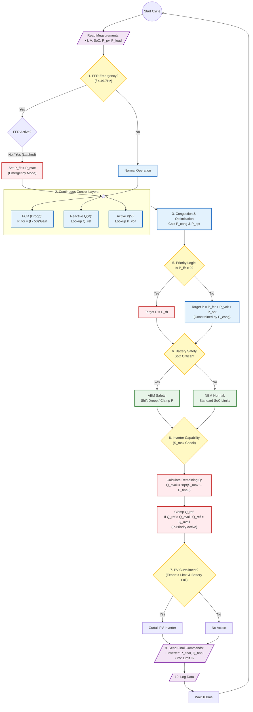

OpenEms Grid support

```mermaid
graph TD
    %% Styling Definitions
    classDef critical fill:#ffebee,stroke:#c62828,stroke-width:2px;
    classDef process fill:#e3f2fd,stroke:#1565c0,stroke-width:2px;
    classDef decision fill:#fff9c4,stroke:#fbc02d,stroke-width:2px;
    classDef io fill:#f3e5f5,stroke:#7b1fa2,stroke-width:2px;
    classDef safety fill:#e8f5e9,stroke:#2e7d32,stroke-width:2px;

    Start((Start Cycle)) --> ReadInputs[/"Read Measurements:<br>• f, V, SoC, P_pv, P_load"/]
    class ReadInputs io

    ReadInputs --> FFR_Check{"1. FFR Emergency?<br>(f < 49.7Hz)"}
    class FFR_Check decision

    %% --- Step 1: FFR Logic ---
    FFR_Check -- Yes --> FFR_ActiveCheck{"FFR Active?"}
    FFR_ActiveCheck -- "No / Yes (Latched)" --> SetFFR["Set P_ffr = P_max<br>(Emergency Mode)"]
    class SetFFR critical
    
    FFR_Check -- No --> NoFFR["Normal Operation"]
    class NoFFR process

    %% --- Step 2: Parallel Controllers ---
    SetFFR --> VoltSplit
    NoFFR --> VoltSplit
    
    subgraph Control_Layer ["2. Continuous Control Layers"]
        direction TB
        VoltSplit(( )) --> CalcFCR["FCR (Droop):<br>P_fcr = (f - 50)*Gain"]
        VoltSplit --> CalcQ["Reactive Q(V):<br>Lookup Q_ref"]
        VoltSplit --> CalcP["Active P(V):<br>Lookup P_volt"]
        class CalcFCR,CalcQ,CalcP process
    end

    %% --- Step 3 & 4: Optimization ---
    Control_Layer --> Congestion["3. Congestion & Optimization<br>Calc P_cong & P_opt"]
    class Congestion process

    %% --- Step 5: Priority Combination ---
    Congestion --> PriorityCheck{"5. Priority Logic:<br>Is P_ffr ≠ 0?"}
    class PriorityCheck decision

    PriorityCheck -- Yes --> SetFinalFFR["Target P = P_ffr"]
    class SetFinalFFR critical
    
    PriorityCheck -- No --> SetFinalNormal["Target P = P_fcr + P_volt + P_opt<br>(Constrained by P_cong)"]
    class SetFinalNormal process

    %% --- Step 6: Safety / AEM ---
    SetFinalFFR --> SafetyCheck
    SetFinalNormal --> SafetyCheck

    SafetyCheck{"6. Battery Safety<br>SoC Critical?"}
    class SafetyCheck decision

    SafetyCheck -- Yes --> AEM_Logic["AEM Safety:<br>Shift Droop / Clamp P"]
    SafetyCheck -- No --> NEM_Logic["NEM Normal:<br>Standard SoC Limits"]
    class AEM_Logic,NEM_Logic safety

    %% --- Step 8 (Moved Up): P-Q Capability Check ---
    AEM_Logic --> PQ_Check
    NEM_Logic --> PQ_Check

    PQ_Check{"8. Inverter Capability<br>(S_max Check)"}
    class PQ_Check decision

    PQ_Check --> Calc_S["Calculate Remaining Q:<br>Q_avail = sqrt(S_max² - P_final²)"]
    Calc_S --> Clamp_Q["Clamp Q_ref:<br>If Q_ref > Q_avail, Q_ref = Q_avail<br>(P-Priority Active)"]
    class Calc_S,Clamp_Q critical

    %% --- Step 7: PV Curtailment (Now uses final valid P) ---
    Clamp_Q --> CurtailCheck{"7. PV Curtailment?<br>(Export > Limit & Battery Full)"}
    class CurtailCheck decision

    CurtailCheck -- Yes --> TriggerCurtail["Curtail PV Inverter"]
    CurtailCheck -- No --> NoCurtail["No Action"]
    
    %% --- Outputs ---
    TriggerCurtail --> SendCmd
    NoCurtail --> SendCmd

    SendCmd[/"9. Send Final Commands:<br>• Inverter: P_final, Q_final<br>• PV: Limit %"/] --> LogData[/"10. Log Data"/]
    class SendCmd,LogData io

    LogData --> Wait["Wait 100ms"]
    Wait --> Start
```