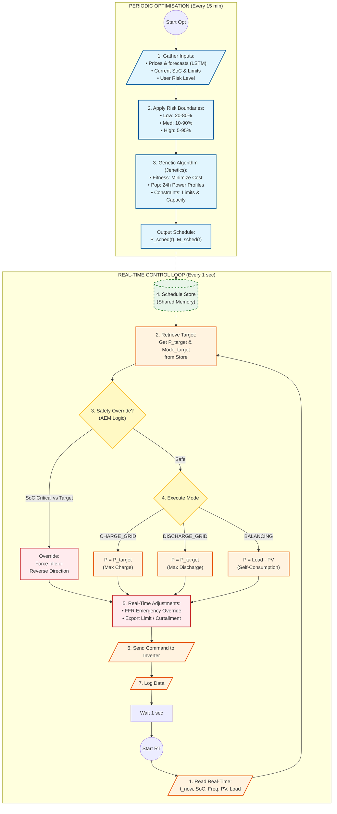

```mermaid
graph TD
    %% Styling Definitions
    classDef opt fill:#e1f5fe,stroke:#01579b,stroke-width:2px;
    classDef rt fill:#fff3e0,stroke:#e65100,stroke-width:2px;
    classDef store fill:#e8f5e9,stroke:#2e7d32,stroke-width:2px,stroke-dasharray: 5 5;
    classDef decision fill:#fff9c4,stroke:#fbc02d,stroke-width:2px;
    classDef urgent fill:#ffebee,stroke:#c62828,stroke-width:2px;

    %% --- SUBGRAPH: Periodic Optimization ---
    subgraph Periodic_Opt ["PERIODIC OPTIMISATION (Every 15 min)"]
        direction TB
        OptStart((Start Opt)) --> GatherData[/"1. Gather Inputs:<br>• Prices & forecasts (LSTM)<br>• Current SoC & Limits<br>• User Risk Level"/]
        class GatherData opt

        GatherData --> ApplyRisk["2. Apply Risk Boundaries:<br>• Low: 20-80%<br>• Med: 10-90%<br>• High: 5-95%"]
        class ApplyRisk opt

        ApplyRisk --> RunGA["3. Genetic Algorithm (Jenetics):<br>• Fitness: Minimize Cost<br>• Pop: 24h Power Profiles<br>• Constraints: Limits & Capacity"]
        class RunGA opt

        RunGA --> OutputSched["Output Schedule:<br>P_sched(t), M_sched(t)"]
        class OutputSched opt
    end

    %% --- SHARED DATA STORE ---
    ScheduleStore[("4. Schedule Store<br>(Shared Memory)")]
    class ScheduleStore store

    OutputSched -.-> ScheduleStore

    %% --- SUBGRAPH: Real-Time Control ---
    subgraph RT_Loop ["REAL-TIME CONTROL LOOP (Every 1 sec)"]
        direction TB
        RTStart((Start RT)) --> ReadRT[/"1. Read Real-Time:<br>t_now, SoC, Freq, PV, Load"/]
        class ReadRT rt

        ReadRT --> RetrieveSched["2. Retrieve Target:<br>Get P_target & Mode_target<br>from Store"]
        class RetrieveSched rt
        
        ScheduleStore -.-> RetrieveSched

        RetrieveSched --> SafetyCheck{"3. Safety Override?<br>(AEM Logic)"}
        class SafetyCheck decision

        SafetyCheck -- "SoC Critical vs Target" --> Override["Override:<br>Force Idle or<br>Reverse Direction"]
        class Override urgent

        SafetyCheck -- "Safe" --> ModeLogic{"4. Execute Mode"}
        class ModeLogic decision

        Override --> FinalAdj
        
        %% Mode Branches
        ModeLogic -- "CHARGE_GRID" --> SetCharge["P = P_target<br>(Max Charge)"]
        ModeLogic -- "DISCHARGE_GRID" --> SetDischarge["P = P_target<br>(Max Discharge)"]
        ModeLogic -- "BALANCING" --> SetBalance["P = Load - PV<br>(Self-Consumption)"]
        
        class SetCharge,SetDischarge,SetBalance rt

        %% Convergence
        SetCharge --> FinalAdj
        SetDischarge --> FinalAdj
        SetBalance --> FinalAdj

        FinalAdj["5. Real-Time Adjustments:<br>• FFR Emergency Override<br>• Export Limit / Curtailment"]
        class FinalAdj urgent

        FinalAdj --> SendCmd[/"6. Send Command to Inverter"/]
        class SendCmd rt

        SendCmd --> LogData[/"7. Log Data"/]
        class LogData rt

        LogData --> Wait["Wait 1 sec"]
        Wait --> RTStart
    end
```