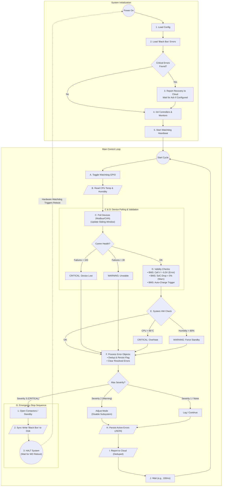

```mermaid
graph TD
    %% --- PHASE 1: INITIALIZATION ---
    subgraph InitPhase [System Initialization]
        direction TB
        Start((Power On)) --> LoadConfig[1. Load Config]
        LoadConfig --> LoadPersist[2. Load 'Black Box' Errors]
        
        LoadPersist --> RecovCheck{Critical Errors<br>Found?}
        RecovCheck -- Yes --> ReportRecov[3. Report Recovery to Cloud<br>Wait for Ack if Configured]
        RecovCheck -- No --> InitDev
        ReportRecov --> InitDev
        
        InitDev[4. Init Controllers & Monitors] --> StartWD[5. Start Watchdog Heartbeat]
    end

    StartWD --> LoopStart

    %% --- PHASE 2: MAIN LOOP ---
    subgraph MainLoop [Main Control Loop]
        direction TB
        LoopStart((Start Cycle)) --> Heartbeat[A. Toggle Watchdog GPIO]
        
        Heartbeat --> ReadEnv[/"B. Read CPU Temp & Humidity"/]

        %% Device Polling Logic
        ReadEnv --> DevicePoll
        
        subgraph DevLogic [C & D: Device Polling & Validation]
            direction TB
            DevicePoll["C. Poll Devices (Modbus/CAN)<br>(Update Sliding Window)"]
            
            DevicePoll --> CommHealth{Comm Health?}
            CommHealth -- "Failures = 100" --> CritDev[CRITICAL: Device Lost]
            CommHealth -- "Failures > 30" --> WarnDev[WARNING: Unstable]
            CommHealth -- "OK" --> DataValid
            
            DataValid["D. Validity Checks:<br>• BMS: Cell V > 6.0V (Error)<br>• BMS: SoC Drop > 5% (Warn)<br>• BMS: Auto-Charge Trigger"]
        end

        %% System Checks
        DataValid --> SysCheck{"E. System HW Check"}
        SysCheck -- "CPU > 85°C" --> CritSys[CRITICAL: Overheat]
        SysCheck -- "Humidity > 80%" --> WarnSys[WARNING: Force Standby]
        SysCheck -- OK --> ErrProc
        
        %% Error Processing & Severity Check
        CritDev --> ErrProc
        WarnDev --> ErrProc
        CritSys --> ErrProc
        WarnSys --> ErrProc

        ErrProc["F. Process Error Objects:<br>• Dedup & Persist Flag<br>• Clear Resolved Errors"] --> SevCheck{Max Severity?}

        %% --- BRANCHING PATHS ---
        
        %% Path 1: Critical (Emergency Stop)
        SevCheck -- "Severity 3 (CRITICAL)" --> EStop
        
        subgraph Emergency [G: Emergency Stop Sequence]
            EStop["1. Open Contactors / Standby"]
            EStop --> WriteBB[/"2. Sync Write 'Black Box' to Disk"/]
            WriteBB --> Halt(("3. HALT System<br>(Wait for WD Reboot)"))
        end

        %% Path 2: Warning/Normal
        SevCheck -- "Severity 2 (Warning)" --> Degraded["Adjust Mode<br>(Disable Subsystem)"]
        SevCheck -- "Severity 1 / None" --> LogOnly["Log / Continue"]
        
        %% Persistence & Reporting
        Degraded --> Persist
        LogOnly --> Persist
        
        Persist[/"H. Persist Active Errors (JSON)"/] --> CloudReport[/"I. Report to Cloud (Deduped)"/]

        CloudReport --> WaitCycle["J. Wait (e.g., 100ms)"]
        WaitCycle --> LoopStart
    end

    %% Reboot Loop (Hardware Watchdog)
    Halt -. "Hardware Watchdog Triggers Reboot" .-> Start
```