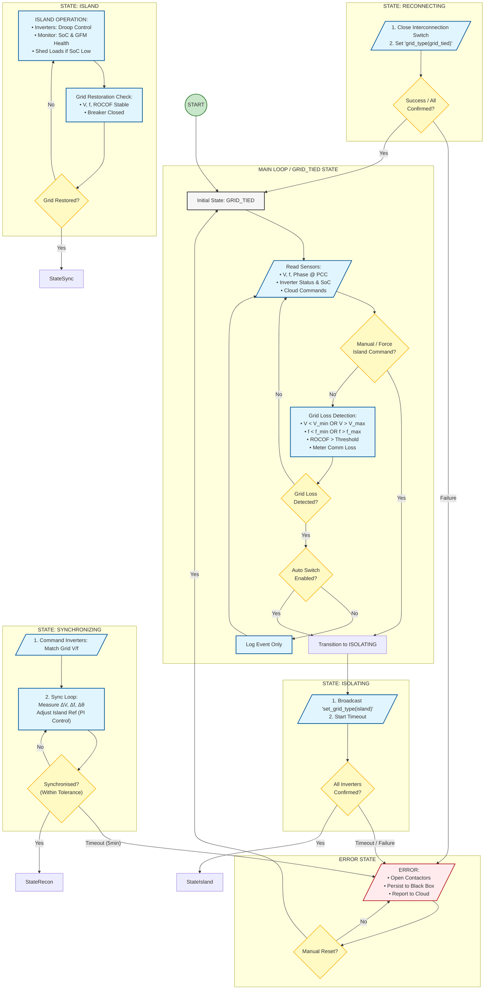

```mermaid
graph TD
    %% Styling
    classDef state fill:#f5f5f5,stroke:#333,stroke-width:2px;
    classDef decision fill:#fff9c4,stroke:#fbc02d,stroke-width:2px;
    classDef process fill:#e1f5fe,stroke:#01579b,stroke-width:2px;
    classDef error fill:#ffebee,stroke:#b71c1c,stroke-width:2px;
    classDef start fill:#c8e6c9,stroke:#2e7d32,stroke-width:2px;

    %% --- INITIALIZATION ---
    Start((START)) --> InitState[Initial State: GRID_TIED]
    class Start start
    class InitState state

    %% --- MAIN LOOP (GRID_TIED) ---
    subgraph GridTied_Loop [MAIN LOOP / GRID_TIED STATE]
        direction TB
        ReadSensors[/"Read Sensors:<br>• V, f, Phase @ PCC<br>• Inverter Status & SoC<br>• Cloud Commands"/]
        class ReadSensors process

        DecManual{"Manual / Force<br>Island Command?"}
        class DecManual decision

        DecLoss{"Grid Loss<br>Detected?"}
        class DecLoss decision

        DetectLogic["Grid Loss Detection:<br>• V < V_min OR V > V_max<br>• f < f_min OR f > f_max<br>• ROCOF > Threshold<br>• Meter Comm Loss"]
        class DetectLogic process

        DecAuto{"Auto Switch<br>Enabled?"}
        class DecAuto decision
        
        LogOnly[Log Event Only]
        class LogOnly process

        %% Connections inside Grid Tied
        InitState --> ReadSensors
        ReadSensors --> DecManual
        
        %% Manual Path (Bypasses Detection)
        DecManual -- Yes --> TransIso[Transition to ISOLATING]
        
        %% Normal Path
        DecManual -- No --> DetectLogic
        DetectLogic --> DecLoss
        
        DecLoss -- No --> ReadSensors
        DecLoss -- Yes --> DecAuto
        
        DecAuto -- No --> LogOnly
        LogOnly --> ReadSensors
        DecAuto -- Yes --> TransIso
    end

    %% --- STATE: ISOLATING ---
    TransIso --> StateIsolating
    
    subgraph ISO_State [STATE: ISOLATING]
        direction TB
        StateIsolating[/"1. Broadcast 'set_grid_type(island)'<br>2. Start Timeout"/]
        class StateIsolating process

        DecIsoConfirm{"All Inverters<br>Confirmed?"}
        class DecIsoConfirm decision
        
        StateIsolating --> DecIsoConfirm
    end

    DecIsoConfirm -- "Timeout / Failure" --> ErrorState
    DecIsoConfirm -- Yes --> StateIsland

    %% --- STATE: ISLAND ---
    subgraph Island_State [STATE: ISLAND]
        direction TB
        IslandOps["ISLAND OPERATION:<br>• Inverters: Droop Control<br>• Monitor: SoC & GFM Health<br>• Shed Loads if SoC Low"]
        class IslandOps process

        DetectRestore["Grid Restoration Check:<br>• V, f, ROCOF Stable<br>• Breaker Closed"]
        class DetectRestore process

        DecRestored{"Grid Restored?"}
        class DecRestored decision

        IslandOps --> DetectRestore --> DecRestored
        DecRestored -- No --> IslandOps
    end

    DecRestored -- Yes --> StateSync

    %% --- STATE: SYNCHRONIZING ---
    subgraph Sync_State [STATE: SYNCHRONIZING]
        direction TB
        SyncCmd[/"1. Command Inverters: Match Grid V/f"/]
        class SyncCmd process

        SyncLoop["2. Sync Loop:<br>Measure ΔV, Δf, Δθ<br>Adjust Island Ref (PI Control)"]
        class SyncLoop process

        DecSynced{"Synchronised?<br>(Within Tolerance)"}
        class DecSynced decision

        SyncCmd --> SyncLoop --> DecSynced
        DecSynced -- No --> SyncLoop
    end

    DecSynced -- "Timeout (5min)" --> ErrorState
    DecSynced -- Yes --> StateRecon

    %% --- STATE: RECONNECTING ---
    subgraph Recon_State [STATE: RECONNECTING]
        direction TB
        ReconAct[/"1. Close Interconnection Switch<br>2. Set 'grid_type(grid_tied)'"/]
        class ReconAct process

        DecReconSuccess{"Success / All<br>Confirmed?"}
        class DecReconSuccess decision

        ReconAct --> DecReconSuccess
    end

    DecReconSuccess -- Failure --> ErrorState
    DecReconSuccess -- Yes --> InitState

    %% --- ERROR STATE ---
    subgraph Err_State [ERROR STATE]
        ErrorState[/"ERROR:<br>• Open Contactors<br>• Persist to Black Box<br>• Report to Cloud"/]
        class ErrorState error

        DecReset{"Manual Reset?"}
        class DecReset decision

        ErrorState --> DecReset
        DecReset -- No --> ErrorState
    end

    DecReset -- Yes --> InitState
```