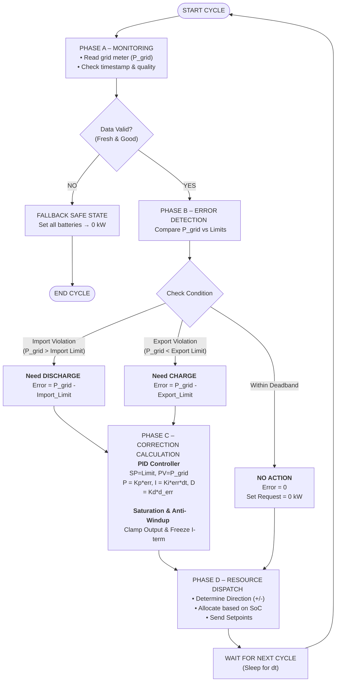

Peak Shaving Logic of ems controller

```mermaid
flowchart TD
    %% Global Styles
    classDef phase fill:#e3f2fd,stroke:#1565c0,stroke-width:2px;
    classDef decision fill:#fff9c4,stroke:#fbc02d,stroke-width:2px;
    classDef hazard fill:#ffcdd2,stroke:#c62828,stroke-width:2px;
    classDef term fill:#e0e0e0,stroke:#616161,stroke-width:2px;

    %% START
    Start([START CYCLE]) --> PhaseA
    style Start term

    %% PHASE A
    PhaseA["PHASE A – MONITORING <br/> • Read grid meter (P_grid) <br/> • Check timestamp & quality"]
    style PhaseA phase
    
    PhaseA --> CheckData

    %% DATA VALIDATION
    CheckData{"Data Valid? <br/> (Fresh & Good)"}
    style CheckData decision

    %% --- NO PATH (Fallback) ---
    CheckData -- NO --> Fallback
    Fallback["FALLBACK SAFE STATE <br/> Set all batteries → 0 kW"]
    style Fallback hazard

    Fallback --> EndCycle([END CYCLE])
    style EndCycle term

    %% --- YES PATH (Main Logic) ---
    CheckData -- YES --> PhaseB

    %% PHASE B
    PhaseB["PHASE B – ERROR DETECTION <br/> Compare P_grid vs Limits"]
    style PhaseB phase

    PhaseB --> CheckCondition{Check Condition}
    style CheckCondition decision

    %% Phase B Logic Branches
    CheckCondition -- "Import Violation <br/> (P_grid > Import Limit)" --> CalcImport["<b>Need DISCHARGE</b> <br/> Error = P_grid - Import_Limit"]
    
    CheckCondition -- "Export Violation <br/> (P_grid < Export Limit)" --> CalcExport["<b>Need CHARGE</b> <br/> Error = P_grid - Export_Limit"]
    
    CheckCondition -- "Within Deadband" --> Deadband["<b>NO ACTION</b> <br/> Error = 0 <br/> Set Request = 0 kW"]

    %% PHASE C (Only if Violation)
    CalcImport --> PhaseC
    CalcExport --> PhaseC
    
    PhaseC["PHASE C – CORRECTION CALCULATION <br/> <b>PID Controller</b> <br/> SP=Limit, PV=P_grid <br/> P = Kp*err, I = Ki*err*dt, D = Kd*d_err <br/> <br/> <b>Saturation & Anti-Windup</b> <br/> Clamp Output & Freeze I-term"]
    style PhaseC phase

    %% PHASE D (Dispatch)
    PhaseC --> PhaseD
    Deadband --> PhaseD

    PhaseD["PHASE D – RESOURCE DISPATCH <br/> • Determine Direction (+/-) <br/> • Allocate based on SoC <br/> • Send Setpoints"]
    style PhaseD phase

    %% WAIT & LOOP
    PhaseD --> Wait
    Wait["WAIT FOR NEXT CYCLE <br/> (Sleep for dt)"]
    style Wait term

    Wait --> Start
```
