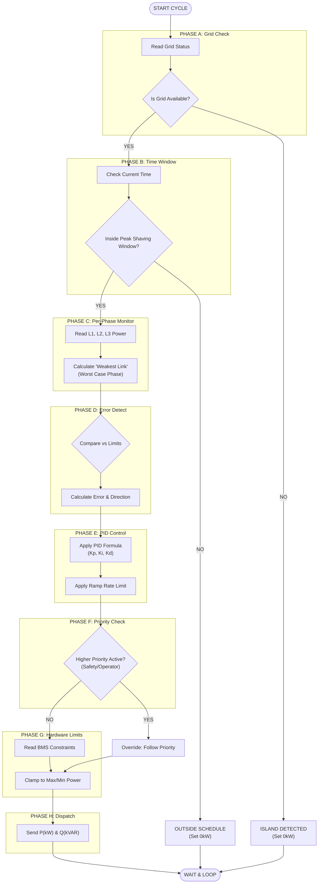

OpensEms peakShaving logic 

```mermaid
flowchart TD
    %% Global Styles
    classDef phase fill:#e3f2fd,stroke:#1565c0,stroke-width:2px
    classDef decision fill:#fff9c4,stroke:#fbc02d,stroke-width:2px
    classDef critical fill:#ffcdd2,stroke:#c62828,stroke-width:2px
    classDef term fill:#e0e0e0,stroke:#616161,stroke-width:2px,rx:10,ry:10
    classDef dispatch fill:#c8e6c9,stroke:#2e7d32,stroke-width:2px

    %% --- START ---
    Start([START CYCLE]) 
    style Start term

    %% --- PHASE A ---
    subgraph PhaseA [PHASE A: Grid Check]
        direction TB
        StepA1["Read Grid Status"]
        CheckGrid{"Is Grid Available?"}
    end
    style StepA1 phase
    style CheckGrid decision

    Start --> StepA1
    StepA1 --> CheckGrid

    %% --- PHASE B ---
    subgraph PhaseB [PHASE B: Time Window]
        direction TB
        StepB1["Check Current Time"]
        CheckTime{"Inside Peak Shaving Window?"}
    end
    style StepB1 phase
    style CheckTime decision

    CheckGrid -- YES --> StepB1
    CheckGrid -- NO --> IslandMode["ISLAND DETECTED <br/> (Set 0kW)"]
    style IslandMode critical

    StepB1 --> CheckTime

    %% --- PHASE C ---
    subgraph PhaseC [PHASE C: Per-Phase Monitor]
        direction TB
        StepC1["Read L1, L2, L3 Power"]
        StepC2["Calculate 'Weakest Link' <br/> (Worst Case Phase)"]
    end
    style StepC1 phase
    style StepC2 phase

    CheckTime -- YES --> StepC1
    CheckTime -- NO --> OutsideSched["OUTSIDE SCHEDULE <br/> (Set 0kW)"]
    style OutsideSched term

    StepC1 --> StepC2

    %% --- PHASE D ---
    subgraph PhaseD [PHASE D: Error Detect]
        direction TB
        CheckLimits{"Compare vs Limits"}
        CalcError["Calculate Error & Direction"]
    end
    style CheckLimits decision
    style CalcError phase

    StepC2 --> CheckLimits
    CheckLimits --> CalcError

    %% --- PHASE E ---
    subgraph PhaseE [PHASE E: PID Control]
        direction TB
        DoPID["Apply PID Formula <br/> (Kp, Ki, Kd)"]
        DoRamp["Apply Ramp Rate Limit"]
    end
    style DoPID phase
    style DoRamp phase

    CalcError --> DoPID
    DoPID --> DoRamp

    %% --- PHASE F ---
    subgraph PhaseF [PHASE F: Priority Check]
        direction TB
        CheckPrio{"Higher Priority Active? <br/> (Safety/Operator)"}
    end
    style CheckPrio decision

    DoRamp --> CheckPrio

    %% --- PHASE G ---
    subgraph PhaseG [PHASE G: Hardware Limits]
        direction TB
        ReadBMS["Read BMS Constraints"]
        Clamp["Clamp to Max/Min Power"]
    end
    style ReadBMS phase
    style Clamp phase

    CheckPrio -- NO --> ReadBMS
    CheckPrio -- YES --> ForceCmd["Override: Follow Priority"]
    style ForceCmd critical
    
    ForceCmd --> Clamp
    ReadBMS --> Clamp

    %% --- PHASE H ---
    subgraph PhaseH [PHASE H: Dispatch]
        direction TB
        Send["Send P(kW) & Q(kVAR)"]
    end
    style Send dispatch

    Clamp --> Send

    %% --- LOOP ---
    Loop([WAIT & LOOP])
    style Loop term

    Send --> Loop
    IslandMode --> Loop
    OutsideSched --> Loop
```