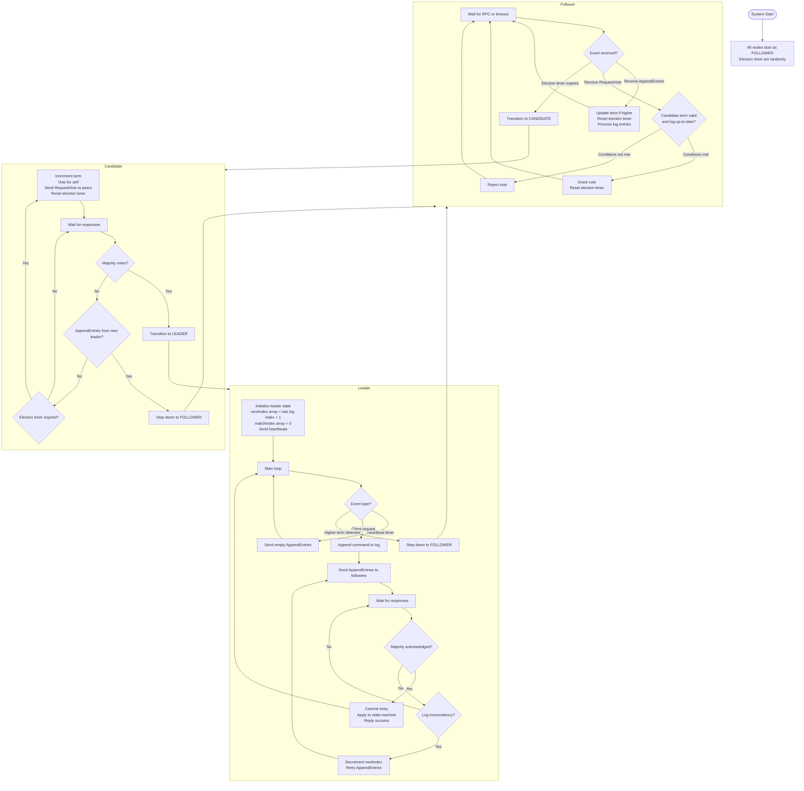

```mermaid
graph TD
    Start([System Start]) --> AllStart[All nodes start as FOLLOWER<br/>Election timer set randomly]

    subgraph Follower
        direction TB
        F1[Wait for RPC or timeout] --> F2{Event received?}
        F2 -->|Receive AppendEntries| F3[Update term if higher<br/>Reset election timer<br/>Process log entries]
        F3 --> F1
        
        F2 -->|Receive RequestVote| F4{Candidate term valid<br/>and log up-to-date?}
        F4 -->|Conditions met| F5[Grant vote<br/>Reset election timer]
        F4 -->|Conditions not met| F6[Reject vote]
        F5 --> F1
        F6 --> F1
        
        F2 -->|Election timer expired| F7[Transition to CANDIDATE]
    end

    subgraph Candidate
        direction TB
        C1[Increment term<br/>Vote for self<br/>Send RequestVote to peers<br/>Reset election timer] --> C2[Wait for responses]
        C2 --> C3{Majority votes?}
        C3 -->|Yes| C4[Transition to LEADER]
        C3 -->|No| C5{AppendEntries from new leader?}
        C5 -->|Yes| C6[Step down to FOLLOWER]
        C5 -->|No| C7{Election timer expired?}
        C7 -->|Yes| C1
        C7 -->|No| C2
    end

    subgraph Leader
        direction TB
        L0[Initialize leader state<br/>nextIndex array = last log index + 1<br/>matchIndex array = 0<br/>Send heartbeats] --> L1[Main loop]
        
        L1 --> L2{Event type?}
        
        L2 -->|Heartbeat timer| L3[Send empty AppendEntries]
        L3 --> L1
        
        L2 -->|Client request| L4[Append command to log]
        L4 --> L5[Send AppendEntries to followers]
        L5 --> L6[Wait for responses]
        
        L6 --> L7{Majority acknowledged?}
        L7 -->|Yes| L8[Commit entry<br/>Apply to state machine<br/>Reply success]
        L8 --> L1
        
        L7 -->|No| L9{Log inconsistency?}
        L9 -->|Yes| L10[Decrement nextIndex<br/>Retry AppendEntries]
        L10 --> L5
        L9 -->|No| L6
        
        L2 -->|Higher term detected| L11[Step down to FOLLOWER]
    end

    F7 --> Candidate
    C4 --> Leader
    C6 --> Follower
    L11 --> Follower


```