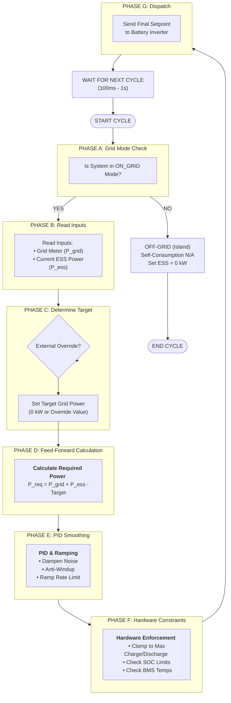

self consumption logic from open ems

```mermaid
flowchart TD
    %% Global Styles
    classDef phase fill:#e3f2fd,stroke:#1565c0,stroke-width:2px
    classDef decision fill:#fff9c4,stroke:#fbc02d,stroke-width:2px
    classDef critical fill:#ffcdd2,stroke:#c62828,stroke-width:2px
    classDef term fill:#e0e0e0,stroke:#616161,stroke-width:2px,rx:10,ry:10
    classDef dispatch fill:#c8e6c9,stroke:#2e7d32,stroke-width:2px

    %% --- START ---
    Start([START CYCLE]) 
    style Start term

    %% --- PHASE A ---
    subgraph PhaseA [PHASE A: Grid Mode Check]
        direction TB
        StepA["Is System in ON_GRID Mode?"]
    end
    style StepA decision

    Start --> PhaseA
    
    %% Decision Logic
    PhaseA -- NO --> OffGrid["OFF-GRID (Island) <br/> Self-Consumption N/A <br/> Set ESS = 0 kW"]
    style OffGrid critical
    OffGrid --> EndCycle([END CYCLE])
    style EndCycle term

    %% --- PHASE B (Only reachable if Grid is YES) ---
    PhaseA -- YES --> PhaseB

    subgraph PhaseB [PHASE B: Read Inputs]
        direction TB
        StepB["Read Inputs: <br/> • Grid Meter (P_grid) <br/> • Current ESS Power (P_ess)"]
    end
    style StepB phase

    PhaseB --> PhaseC

    %% --- PHASE C ---
    subgraph PhaseC [PHASE C: Determine Target]
        direction TB
        CheckOverride{"External Override?"}
        SetTarget["Set Target Grid Power <br/> (0 kW or Override Value)"]
    end
    style CheckOverride decision
    style SetTarget phase

    PhaseC --> CheckOverride
    CheckOverride --> SetTarget

    %% --- PHASE D ---
    subgraph PhaseD [PHASE D: Feed-Forward Calculation]
        direction TB
        CalcReq["<b>Calculate Required Power</b> <br/> P_req = P_grid + P_ess - Target"]
    end
    style CalcReq phase

    SetTarget --> PhaseD

    %% --- PHASE E ---
    subgraph PhaseE [PHASE E: PID Smoothing]
        direction TB
        PID_Algo["<b>PID & Ramping</b> <br/> • Dampen Noise <br/> • Anti-Windup <br/> • Ramp Rate Limit"]
    end
    style PID_Algo phase

    PhaseD --> PhaseE

    %% --- PHASE F ---
    subgraph PhaseF [PHASE F: Hardware Constraints]
        direction TB
        ApplyLimits["<b>Hardware Enforcement</b> <br/> • Clamp to Max Charge/Discharge <br/> • Check SOC Limits <br/> • Check BMS Temps"]
    end
    style ApplyLimits phase

    PhaseE --> PhaseF

    %% --- PHASE G ---
    subgraph PhaseG [PHASE G: Dispatch]
        direction TB
        SendCommand["Send Final Setpoint <br/> to Battery Inverter"]
    end
    style SendCommand dispatch

    PhaseF --> PhaseG

    %% --- LOOP ---
    Wait["WAIT FOR NEXT CYCLE <br/> (100ms - 1s)"]
    style Wait term

    PhaseG --> Wait
    Wait --> Start
```