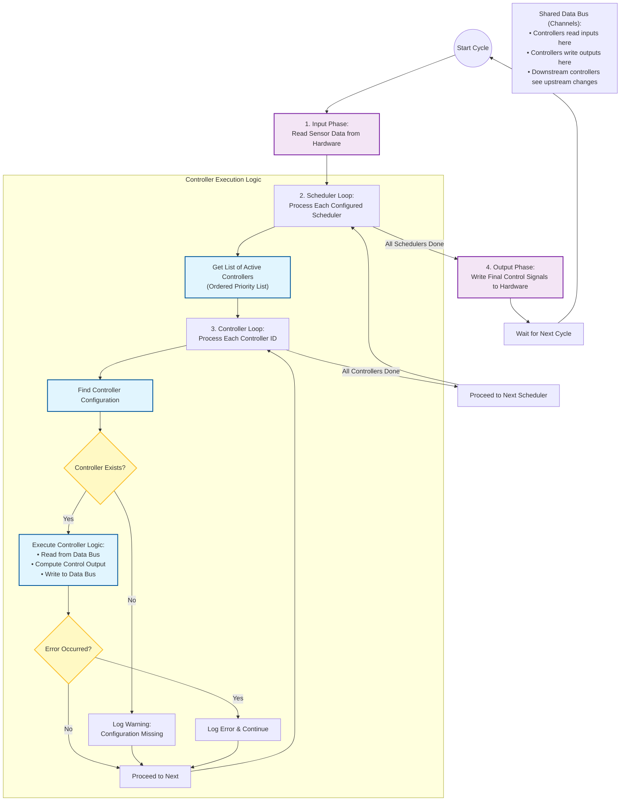

```mermaid
graph TD
    Start((Start Cycle)) --> InputPhase["1. Input Phase:<br>Read Sensor Data from Hardware"]
    InputPhase --> SchedulerLoop["2. Scheduler Loop:<br>Process Each Configured Scheduler"]
    
    subgraph ExecutionLogic ["Controller Execution Logic"]
        SchedulerLoop --> GetList["Get List of Active Controllers<br>(Ordered Priority List)"]
        GetList --> ControllerLoop["3. Controller Loop:<br>Process Each Controller ID"]
        
        ControllerLoop --> Lookup["Find Controller Configuration"]
        Lookup --> Found{"Controller Exists?"}
        
        Found -->|Yes| RunLogic["Execute Controller Logic:<br>• Read from Data Bus<br>• Compute Control Output<br>• Write to Data Bus"]
        Found -->|No| LogWarn["Log Warning:<br>Configuration Missing"]
        
        RunLogic --> CheckError{"Error Occurred?"}
        CheckError -->|Yes| LogErr["Log Error & Continue"]
        CheckError -->|No| NextCtrl["Proceed to Next"]
        
        LogWarn --> NextCtrl
        LogErr --> NextCtrl
        NextCtrl --> ControllerLoop
    end
    
    ControllerLoop -->|All Controllers Done| NextSched["Proceed to Next Scheduler"]
    NextSched --> SchedulerLoop
    
    SchedulerLoop -->|All Schedulers Done| OutputPhase["4. Output Phase:<br>Write Final Control Signals to Hardware"]
    
    OutputPhase --> Wait["Wait for Next Cycle"] --> Start
    
    %% Note regarding the data bus
    Note["Shared Data Bus (Channels):<br>• Controllers read inputs here<br>• Controllers write outputs here<br>• Downstream controllers see upstream changes"]
    
    %% Styling
    classDef process fill:#e1f5fe,stroke:#01579b,stroke-width:2px;
    classDef decision fill:#fff9c4,stroke:#fbc02d,stroke-width:2px;
    classDef io fill:#f3e5f5,stroke:#7b1fa2,stroke-width:2px;
    
    class InputPhase,OutputPhase io;
    class RunLogic,GetList,Lookup process;
    class Found,CheckError decision;
```