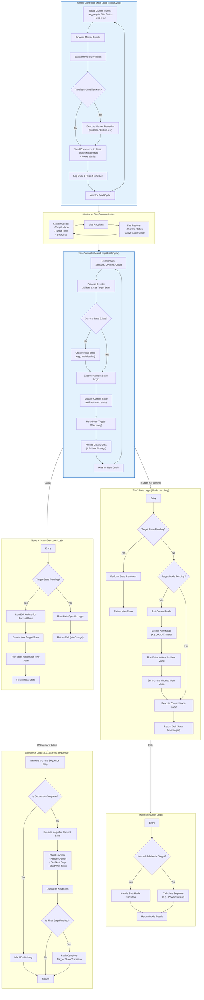

```mermaid
graph TD
    %% Site Controller Main Loop
    subgraph SiteController ["Site Controller Main Loop (Fast Cycle)"]
        direction TB
        A["Read Inputs:<br>Sensors, Devices, Cloud"] --> B["Process Events:<br>Validate & Set Target State"]
        B --> C{"Current State Exists?"}
        C -->|No| D["Create Initial State<br>(e.g., Initialization)"]
        D --> E
        C -->|Yes| E["Execute Current State Logic"]
        E --> F["Update Current State<br>(with returned state)"]
        F --> G["Heartbeat (Toggle Watchdog)"]
        G --> H["Persist Data to Disk<br>(if Critical Change)"]
        H --> I["Wait for Next Cycle"] --> A
    end

    %% Generic State Execution
    subgraph StateNodeRun ["Generic State Execution Logic"]
        direction TB
        J[Entry] --> K{"Target State Pending?"}
        K -->|Yes| L[Run Exit Actions for Current State]
        L --> M[Create New Target State]
        M --> N[Run Entry Actions for New State]
        N --> O[Return New State]
        K -->|No| P["Run State-Specific Logic"]
        P --> Q["Return Self (No Change)"]
    end

    %% Sequence Logic
    subgraph ExecuteDetail ["Sequence Logic (e.g., Startup Sequence)"]
        direction TB
        R["Retrieve Current Sequence Step"] --> S{"Is Sequence Complete?"}
        S -->|Yes| T["Idle / Do Nothing"] --> U[Return]
        S -->|No| V[Execute Logic for Current Step]
        V --> W["Step Function:<br>- Perform Action<br>- Set Next Step<br>- Start Wait Timer"]
        W --> X["Update to Next Step"]
        X --> Y{"Is Final Step Finished?"}
        Y -->|Yes| Z["Mark Complete<br>Trigger State Transition"]
        Y -->|No| U
        Z --> U
    end

    %% Operational State Logic (Mode Handling)
    subgraph RunStateDetail ["'Run' State Logic (Mode Handling)"]
        direction TB
        AA[Entry] --> AB{"Target State Pending?"}
        AB -->|Yes| AC["Perform State Transition"] --> AD[Return New State]
        AB -->|No| AE{"Target Mode Pending?"}
        AE -->|Yes| AF[Exit Current Mode]
        AF --> AG["Create New Mode<br>(e.g., Auto-Charge)"]
        AG --> AH[Run Entry Actions for New Mode]
        AH --> AI["Set Current Mode to New Mode"]
        AI --> AJ["Execute Current Mode Logic"]
        AE -->|No| AJ
        AJ --> AK["Return Self (State Unchanged)"]
    end

    %% Mode Logic
    subgraph ModeNodeRun ["Mode Execution Logic"]
        direction TB
        BA[Entry] --> BB{"Internal Sub-Mode Target?"}
        BB -->|Yes| BC[Handle Sub-Mode Transition]
        BB -->|No| BD["Calculate Setpoints<br>(e.g., Power/Current)"]
        BC --> BE[Return Mode Result]
        BD --> BE
    end

    %% Master Controller Loop
    subgraph MasterController ["Master Controller Main Loop (Slow Cycle)"]
        direction TB
        CA["Read Cluster Inputs:<br>- Aggregate Site Status<br>- Grid V & f"] --> CB[Process Master Events]
        CB --> CC[Evaluate Hierarchy Rules]
        CC --> CD{"Transition Condition Met?"}
        CD -->|Yes| CE["Execute Master Transition<br>(Exit Old / Enter New)"]
        CD -->|No| CF
        CE --> CF["Send Commands to Sites:<br>- Target Mode/State<br>- Power Limits"]
        CF --> CG["Log Data & Report to Cloud"]
        CG --> CH[Wait for Next Cycle] --> CA
    end

    %% Interaction
    subgraph Interaction ["Master ↔ Site Communication"]
        direction LR
        DA["Master Sends:<br>- Target Mode<br>- Target State<br>- Setpoints"] --> DB["Site Receives"]
        DB --> DC["Site Reports:<br>- Current Status<br>- Active State/Mode"]
        DC --> DA
    end

    %% Connections
    SiteController -- "Calls" --> StateNodeRun
    SiteController -- "If State is 'Running'" --> RunStateDetail
    RunStateDetail -- "Calls" --> ModeNodeRun
    StateNodeRun -- "If Sequence Active" --> ExecuteDetail
    MasterController --> Interaction
    Interaction --> SiteController

    %% Styling
    classDef loop fill:#e3f2fd,stroke:#1565c0,stroke-width:2px;
    class SiteController,MasterController loop;
```