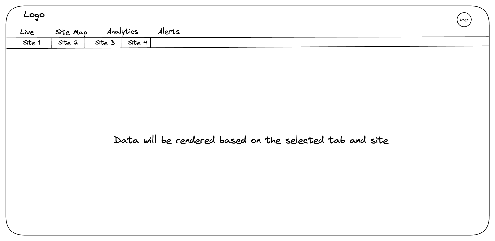
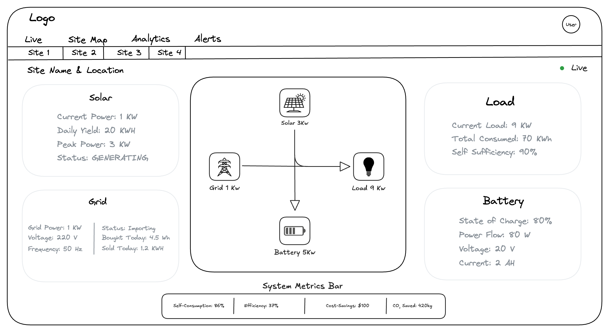
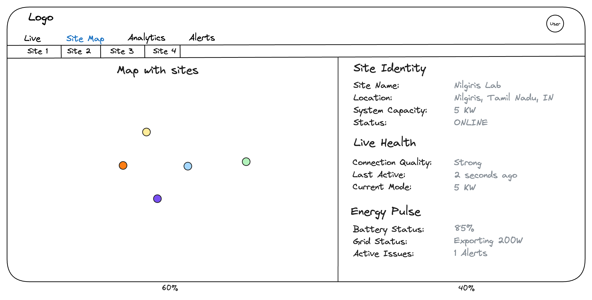

# Dashboard & Integration

## Project Overview
We are building a Real-Time Energy Management Dashboard using Next.js. The dashboard acts as a "Digital Twin", visualizing high-frequency telemetry (Voltage, Power, State) streaming from our Edge devices.



**Key Requirement**: Multi-Site Scalability Although Phase 1 uses only one physical site, the UI must be built dynamically to support *N* sites.

- **Logic**: The dashboard layout is a Template. It should not hardcode "Home Lab".

- **Trigger**: A "Site Selector" (Tabs/Dropdown) controls which data stream is currently rendering.

- **Payload**: The WebSocket stream will contain a *device_id*. The UI must filter/route messages based on the selected site.

## Data Contracts
To ensure the UI works with the backend when it is ready, please use these exact TypeScript definitions for your components.

### Telemetry Packet (Live Stream)

This is the data you will receive each second through WebSocket.

```typescript
// source: communication-interface.md

export interface SystemStatus {
  state: "IDLE" | "CHARGING" | "DISCHARGING" | "FULL" | "EMPTY" | "ERROR";
  mode: "AUTO" | "MANUAL";
  error_flags: string[]; // e.g., ["OVERHEAT", "COMM_LOSS"]
  wifi_strength: number;
}

export interface BatteryData {
  voltage: number;      // V
  current: number;      // A (Positive = Charging)
  power: number;        // W
  soc: number;          // % (0-100)
}

export interface GridData {
  voltage: number;      // V
  power: number;        // W (Negative = Exporting)
  frequency: number;    // Hz
}

export interface TelemetryPayload {
  device_id: string;    // Crucial for Multi-Site filtering
  timestamp: string;    // ISO 8601
  system_status: SystemStatus;
  battery: BatteryData;
  grid: GridData;
}
```

### Site Configuration
Since the telemetry only sends IDs (e.g., ems_001), the Frontend needs a "Config Map" to make it human-readable.

```typescript
export interface SiteConfig {
  id: string;           // Matches 'device_id' in payload
  name: string;         // Display Name (e.g., "Coimbatore Campus")
  capacity_kw: number;  // For calculating load percentages
  location: string;
}

// MOCK CONFIG FOR PHASE 1
export const SITES: SiteConfig[] = [
  { id: "ems_001", name: "Home Lab (Primary)", capacity_kw: 5, location: "Nilgiris" },
  { id: "ems_002", name: "Remote Site A", capacity_kw: 10, location: "Coimbatore" }, // Placeholder
];
```

### Implementation Strategy

#### Step 1: Site Context Provider
We should not pass *device_id* as props through 10 layers of components.

- Create a React Context

- Store: *selectedSiteId* (default: *ems_001*)

- Behavior: When the user clicks a Tab (Site 1/Site 2), the context should be updated based on that. All charts should automatically re-render with data for the new ID.

#### Step 2: Webhook Integration (Hook)
Create a hook *useTelemetry(siteId)* that manages the connection.

- **Logic**:
    1. Connect to 
        *wss://api.domain.com/ws/device/{siteId}*
    
    2. If *siteId* changes, close the old socket and open a new one.

    3. Return the *latestData* object.

#### Step 3: Dynamic Rendering Rules
The dashboard must react visually to the *system_status_state*:

| State        | Color Theme    | UI Behavior                                              |
|--------------|----------------|----------------------------------------------------------|
| CHARGING     | Green / Teal   | Show arrow moving Grid → Battery                         |
| DISCHARGING  | Blue / Cyan    | Show arrow moving Battery → House                        |
| IDLE         | Gray           | Animations stopped                                       |
| ERROR        | Red / Pulse    | Show a prominent alert banner with `error_flags`         |

# Tabs

## Live Tab



### Grid Metrics (Source-based Parameters)

| Parameter  | Unit | Purpose                                                                                                                         | Source           |
| ---------- | ---- | ------------------------------------------------------------------------------------------------------------------------------- | ---------------- |
| Grid Power | W    | The **Net Meter** value. <br>• Positive (+): You are **Paying (Importing)** <br>• Negative (−): You are **Earning (Exporting)** | `grid.power`     |
| Voltage    | V    | Critical for safety. If this drops **< 200V** or spikes **> 250V**, show a warning.                                             | `grid.voltage`   |
| Frequency  | Hz   | Grid health indicator (Standard: **50.0Hz or 60.0Hz**).                                                                         | `grid.frequency` |

---

### Grid Derived Metrics (Frontend Logic)

| Parameter      | Formula / Logic                                              | UI Display                                                |
| -------------- | ------------------------------------------------------------ | --------------------------------------------------------- |
| Flow Status    | If `grid.power < 0` → **Exporting** <br>Else → **Importing** | Show text **“Selling to Grid”** vs **“Buying from Grid”** |
| Total Imported | Sum of `(Power × Time)` only when `Power > 0`                | **“Bought Today: 4.5 kWh”**                               |
| Total Exported | Sum of `(abs(Power) × Time)` only when `Power < 0`           | **“Sold Today: 1.2 kWh”**                                 |

---

### Load & Consumption Metrics

| Parameter        | Unit | Purpose                                                                               | Formula (Frontend Logic)                     |
| ---------------- | ---- | ------------------------------------------------------------------------------------- | -------------------------------------------- |
| Current Load     | W    | The **Live** number for the diagram.                                                  | `Load = GridPower + Solar − BatteryPower`    |
| Total Consumed   | kWh  | The total energy used today.                                                          | Sum of `(Load × Time)` since midnight        |
| Self-Sufficiency | %    | A critical **Green Score** showing how much load is powered by Solar/Battery vs Grid. | `(1 − Total Grid Import / Total Load) × 100` |

---

### Battery Metrics (Source-based Parameters)

| Parameter             | Unit | Purpose                                                                                           | Source            |
| --------------------- | ---- | ------------------------------------------------------------------------------------------------- | ----------------- |
| State of Charge (SOC) | %    | The most important number. Visualized as a **Fuel Gauge** or **Donut Chart**.                     | `battery.soc`     |
| Power Flow            | W    | **Live** number. <br>• Positive (+): Charging <br>• Negative (−): Discharging                     | `battery.power`   |
| Voltage               | V    | Health indicator. If this hits **54.0V (FULL)** or **42.0V (EMPTY)**, the state machine cuts off. | `battery.voltage` |
| Current               | A    | Safety indicator. High current generates heat.                                                    | `battery.current` |

---

### Battery Derived Metrics & State

| Parameter     | Formula / Logic                              | UI Display                                     |
| ------------- | -------------------------------------------- | ---------------------------------------------- |
| Time to Empty | `(Capacity_Wh × SOC%) / Current_Power`       | **“2h 15m remaining”** (Only when Discharging) |
| Time to Full  | `(Capacity_Wh × (1 − SOC%)) / Current_Power` | **“45m to full”** (Only when Charging)         |
| Cycle Status  | `system_status.state`                        | **“Status: CHARGING”** (Mapped directly)       |

## Site Map Tab



## Layout Architecture

### Structure
- Container: Use a Flexbox container with a fixed height (e.g., *calc(100vh - 64px*))

- Left Column (60%): The Map Canvas. It renders the geographical "Pins".

- Right Column (40%): The information Panel. It renders the data for the currently selected pin.

### The Interactive Map

To visualize fleet distribution and provide high-level status at a glance.

- **Data Source**: *SITE_MAP_DATA* (Static Array)

- **Rendering Logic**:
    1. Iterate through the *SITE_MAP_ARRAY* array.
    2. Place a marker at *{lat, lng}* for each site.
    3. **Color Coding**:
        - **Green**: System is healthy (*state != ERROR && timestamp < 60s*)
        - **Red**: System is in trouble (*state == ERROR or error* or *error_flags > 0*)
        - **Gray**: System is offline (timestamp > 60s).
    4. **Interaction**: While clicking a site it should render the Details panel in the right side as shown in the above layout.

### Details Panel
It shows the "Identity", "health", and "pulse" of the selected site as shown in the wireframe.

#### Site Identity (Static Data)

- **Data Source**: *SITE_MAP_DATA* (Config file).

- **Fields**: Site Name, Location, Capacity, Status.

The above fields are static data so they can remain unchanged.

#### Live Health (Telemetry)

- **Data Source**: Websocket Stream (*system_status* object)

- **Fields**: Connection Quality, Last Active and Mode should be updated from the websocket each second.

#### Energy Pulse (Telemetry)

- **Data Source**: Websocket Stream (*battery* & *grid* object).

- **Fields**: Battery Status, Grid Status, Active Issues.

These fields should be rendered from the Websocket that emits the battery data.

**Note**: We need to utilize a store management tool (like redux or zustand) to handle the data efficiently across component persistantly.